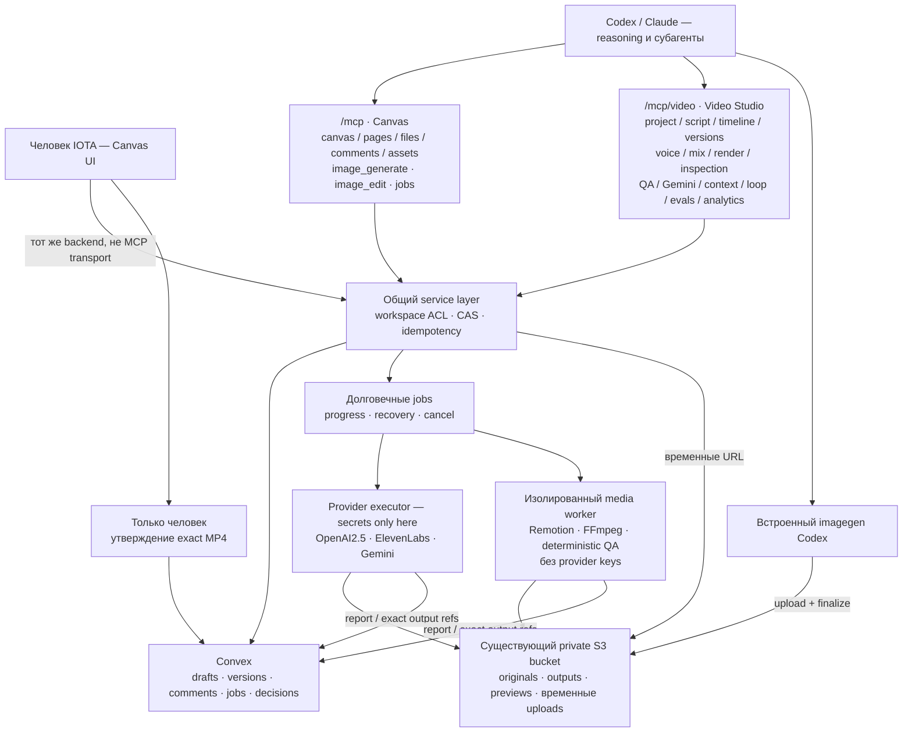

# Implementation authorization and preserved design

2026-09-11 — **Current MCP connection contract:** Canvas and Video Studio now
share the single `https://canvas.iota.uz/mcp` endpoint and one catalog, including
shared assets, comments, jobs, resources and `execute`. This replaces every
two-endpoint proposal in the preserved planning history below, including sections
13–14. The former `/mcp/video` route is removed, not aliased. Native harness
discovery and the existing typed domain tools remain; no duplicate shared tools
or generic discovery dispatcher is introduced. Local client configurations switch
to the single connection only after deployment verification. See
[the governing ADR](../adr/mcp/unified-canvas-and-video-mcp.md) and
[current operations](VIDEO-OPERATIONS.md).

2026-09-10: The user explicitly requested full implementation and production rollout using a Codex-only agent swarm. The historical planning-only statements below describe earlier turns; they do not revoke that implementation authorization. Production verification, real provider availability, human creative approval and physical deletion of the source repository remain distinct gates. No paid fallback or automatic social publishing is authorized.

Canonical implementation target: visual-mcp, main. Preserve source data and transfer remaining issues; archive the old repository only after verified migration. Physical deletion requires separate confirmation. Accepted upload limit: **2,000,000,000 bytes (decimal 2 GB)**. No budget subsystem. Current contracts: sections 13 and 14 override conflicting historical proposals. Accepted ADRs record governing decisions; implementation/test/release evidence must be tracked separately. The complete original plan follows unchanged, including its historical signature archive.

Implementation capability finding, 2026-09-10: the orchestrator checked the official [OpenAI image-generation guide](https://developers.openai.com/api/docs/guides/image-generation), which names `gpt-image-2.5-sunburst` and `gpt-image-2.5-flare`. Treat bare `gpt-image-2.5` below as the family requirement, not a verified literal API model ID. Account entitlement and live generation remain unverified; no paid pilot was performed by this release-readiness slice.

---

# Visual Canvas + video production — согласованный план и проект MCP

Дата: 2026-09-09. Статус: planning only; этот файл не означает, что миграция или новые инструменты реализованы. Автор решения по требованиям — пользователь в текущей переписке. Архитектурные предложения ниже явно отделены от принятых требований.

Актуальная редакция дизайна: раздел 13 — интуитивность, контракты и исправление ошибок; раздел 14 — принятое дополнение Higgsfield и производство отдельных шотов (2026-09-10). Раздел 13 имеет приоритет над разделами 3–4, 11 и 12; раздел 14 дополняет его и уточняет provider-specific ограничения. В частности, серверных search_tools/describe_tools нет; execute переиспользует runtime canvas_run, отдельная VM не является блокером. Раздел 11 сохранён дословно как исторический ответ. Раздел 12 — предыдущая редакция review, а не самостоятельный актуальный контракт. Требования пользователя из раздела 1 продолжают действовать с явными уточнениями разделов 13–14. Все новые контракты остаются proposed до реализации и испытаний.

## 0. Возобновление после compaction

Прочитать этот файл целиком, затем инструкции целевого репозитория и живой git/status/issues. Не восстанавливать уже завершённую работу и не считать этот снимок текущим состоянием deployment. Для новой визуализации перечитать полный visualize skill.

- Источник: `/Users/diyorkhaydarov/Projects/toys/claude-reels`, GitHub `iota-uz/claude-reels`.
- Цель: `/Users/diyorkhaydarov/Projects/toys/visual-mcp`, GitHub `iota-uz/visual-mcp`, продукт Visual Canvas, домен `canvas.iota.uz`.
- Все четыре временных worktree Reels удалены по запросу пользователя. Не использовать `/Volumes/external/reels-*` и не создавать новые worktree без учёта последнего запроса и AGENTS.md цели. В visual-mcp разрешены изменения только main, если пользователь явно не выбрал другую ветку.
- Последняя поставка Reels: main `f9dd108`, PR17 merged, tested tree49cc349. 90 core/workflow/eval +17 UI tests, build/typecheck и LinuxCI34376526977 pass. Эти результаты относятся к Reels до миграции, не к будущему Canvas.
- Локальное preview `http://127.0.0.1:65086`, PID46849/session83042 на момент переноса runtime, из основного checkout Reels. PID перепроверять до остановки.
- Его данные: `/Users/diyorkhaydarov/Workbench/outputs/claude-reels-delivery/root-final-demo/e2e-3id2dz/production`, run `b746c128-13b6-4aa6-840f-810a48016804`. Это синтетический RU/UZ-пилот. Сохранённые материалы/замечания не удалять при переносе. Временный runtime и production данные различать.
- Подробный предыдущий handoff: `/Users/diyorkhaydarov/Workbench/outputs/reels-ux-polish/HANDOFF.md`.
- Файл намеренно находится в /tmp по прямой просьбе пользователя. Переживает compaction, но не гарантированно очистку ОС/перезагрузку. Перед реализацией перенести принятые решения в ADR/задачи целевого проекта.
- Секретов в этом файле нет. Не читать/выводить .env при обычном исследовании.

## 1. Принятые пользователем требования

1. Полностью перенести функциональность claude-reels внутрь visual-mcp. Один продукт/монорепозиторий. Переделать frontend под компоненты и стиль Canvas. Впоследствии отказаться от отдельного Reels-репозитория.
2. Перенести оставшиеся открытые GitHub-задачи; сначала сверить acceptance с кодом и evidence, не считать все открытые задачи полностью нереализованными.
3. Доступ только внутренний, для IOTA. Никакой анонимной платной генерации и публичного SaaS signup.
4. Общий server-side OpenAI image generation/editing в Canvas, доступный через UI и MCP, не только для видео. Проектировать API-путь под `gpt-image-2.5` по прямому выбору пользователя. Проверить действительную доступность этой модели в API перед paid smoke; не подменять модель молча.
5. Codex преимущественно использует встроенный imagegen в своей сессии ради экономии API-расходов; затем импортирует результат в общую Asset Library. Не делать отдельный Codex imagegen skill и не имитировать вызов встроенного инструмента из облачного Node worker.
6. Отсутствие встроенного инструмента НЕ разрешает незаметный платный fallback. Явно выбрать серверный путь или остановиться с понятным состоянием ожидания. Встроенная генерация расходует лимиты Codex, не считать её безлимитной/бесплатной.
7. Временное отличие встроенной модели от2.5 пользователь принял. Сохранять честную фактическую модель/источник, unknown при отсутствии подтверждения; не маркировать встроенный результат как2.5 автоматически.
8. ElevenLabs TTS — server-side по умолчанию, общий серверный инструмент UI/MCP. API-ключ только в server secrets. Явные voice/model/settings, RU и UZ, тайминги речи для монтажа/субтитров. Пригодность узбекского произношения проверить прослушиванием, не обещать на основании названия модели.
9. Gemini остаётся server-side видеокритиком: воспринимает ролик со звуком, возвращает отчёт/таймкоды/уверенность. Не основной управляющий агент, не замена техническим проверкам и человеку.
10. Использовать существующий private S3-compatible bucket Canvas; новый bucket только при конкретно доказанной потребности, не для каждого провайдера/этапа/проекта.
11. Инструмент получения временной ссылки для прямой загрузки через curl, файл до2ГБ. Byte limit явно определить в контракте до реализации (пользователь сказал2ГБ, decimal/binary пока не установлен). Не гонять содержимое через MCP JSON/Convex.
12. Единая модель assets независимо от источника: стабильныйref, immutable revision/hash, размеры/MIME, происхождение и референсы. Повторное использование без копирования bytes.
13. Поддержать создание/редактирование/варианты изображения с референсами. Привязки сцены указывают точную версию; правка изображения не меняет все старые ролики.
14. Автосохранение черновиков сценария/замечаний, конфликт-контроль человек/агент, восстановление после reconnect. Старый job не делает результат текущим поверх свежей правки.
15. Reasoning и управление агентным циклом в существующем Codex/Claude harness. Облако хранит состояние и исполняет jobs после закрытия браузера. Не строить второй Agent SDK/orchestrator или always-on reasoning service в первой версии.
16. Пользователь задаёт тему и направление самим prompt. Farq.uz — первый профиль/бренд, два языка RU/UZ; Canvas остаётся общим продуктом IOTA, не hardcoded Farq-приложением.
17. Бюджетную систему пока не строить. Сразу нужны idempotency, ограничение concurrency, видимые paid side effects, остановка новых jobs и корректный unknown outcome.
18. Финальное человеческое утверждение строго по конкретным языку/версии/MP4 hash; технический QA/Gemini/выбор агентного цикла не дают approval. Просмотр/скачивание черновика доступны до утверждения.
19. Для реализации использовать нативных Codex-агентов, не запускать Claude Code runtime (явное ограничение пользователя предыдущих этапов). При этом продуктовые skills/adapters для Claude и Codex должны иметь отдельные host wrappers и общий workflow где уместно.
20. Пользователь пока просил зафиксировать план и показать архитектуру. Не переносить issues, не deploy, не архивировать/удалять репозитории в этом ходе.

## 2. Подтверждённая база Canvas и конфликты

Проверено в локальном visual-mcp README, AGENTS.md, apps/mcp/src/index.ts/tools.ts и asset security. Это проверка кода/документов, не health check живого облака.

- npm workspaces: apps/web (React/Vite), apps/mcp (stateless MCP runtime), apps/worker (render/sandbox), packages/canvas, packages/runtime, convex (database/auth/BFF).
- Существуют workspaces, authentication, assets/revisions, durable draft_revision, named checkpoints, file/node refs, comments, remote MCP, private object storage и Railway deployment configuration.
- index.ts сейчас регистрирует весь набор на одном POST `/mcp`; scopes verifier пока `mcp`. Разделённые registries/routes и granular scope checks ещё нужно реализовать.
- Asset Library принимает video/mp4 иvideo/webm, но текущий общий file limit25MiB. Audio явно запрещено AGENTS.md и тестом. Видеоимпорт/аудио требуют изменения валидации, metadata, upload/download/access и UI, не только добавления кнопки.
- Canvas checkpoint уже опубликованного холста двигает публичную ревизию. Видео needs separate draft/checkpoint/human approval/publication semantics: autosave, render, critique не публикуют видео. Не сломать существующую canvas publication-модель побочным эффектом.
- CanvasDoc spatial nodes не заменяют canonical screenplay/timeline/jobs. Не прятать весь видеопроект в произвольный iframe HTML.
- В Canvas есть отдельные open issues28–30 по компонентам/их live обновлению и статическим рендерам (последняя read-only проверка2026-09-09); учитывать зависимости, не утверждать зрелость всей component-library заранее.
- AGENTS.md требует ADR для lasting architecture/product decisions; audio restriction и publication semantics пересматриваются отдельными ADR. Green-field posture не разрешает потерять явно поставленные вscope исходные видео/замечания. Изолированный local dev stack вместо подключения тестов к live dev deployment. Never modify liveSITE_URL/SPA_ORIGIN. Не выполнять неизвестные команды dev-agent без контроля secret output.

## 3. Рекомендация по MCP endpoints — PROPOSED, не реализовано

Два логических MCP сервера/профиля на одном домене и, изначально, в одном apps/mcp deployment:

- `https://canvas.iota.uz/mcp` — Visual Canvas: холсты/файлы/страницы/комментарии/библиотека, общий imagegen, upload и компактные jobs.
- `https://canvas.iota.uz/mcp/video` — Video Studio: подготовка видеопроекта, ElevenLabs, монтаж/рендер, технический QA, Gemini, scene/role context, ограниченный improvement loop и его evidence.

Причина: обычной работе с диаграммой/прототипом не нужен полный каталог видеоинструментов и инструкций. Подключение video endpoint по задаче уменьшает лишний tool context и неоднозначность выбора. Это не автоматическая экономия, если клиент постоянно подключает/загружает оба каталога; реальные discovery/activation mechanics проверить в каждом harness. Сервер не может самостоятельно включить MCP в клиенте.

Не плодить отдельный image-MCP, speech-MCP, Gemini-MCP, БД и buckets. Общие handlers/service layer, auth/workspace ACLs, IDs, storage и queue. Независимые MCP sessions/registries/resources поroute; никакой изменяемой глобальной registry под текущего пользователя. Для прав нужны проверки в каждомhandler, а не только скрытие tools/list.

Конкретные scopes предлагаются: workspace read/write, asset read/write, image generate, video produce, jobs manage. Sharedtoken identity допустима, grant проверяется server-side. Cross-endpoint asset_ref/job_ref resolves с той же workspace authorization. Public share tokens не дают generate или внутренниеrefs.

Общий пакет tools подключается обеими registries только в минимально нужном объёме (assets/upload/job inspection/comments). Это переиспользование одной реализации, не двойные backend операции. Полный каталог Canvas не копировать в Video Studio. При подключении обоих клиент может namespace-ить одинаковые общиеtools; проверить UX и ambiguity перед фиксацией surface.

## 4. Полный предлагаемый каталог tool surface

Все новые имена далее — проект интерфейса. Существующие имена проверены по registerTool вapps/mcp/src/tools.ts на2026-09-09. За реализацией/catalog parity нужно следить tests/tools/list; ни один новыйtool здесь пока не callable. Schemas/error contracts уточняются до реализации. Не добавлять generic `execute_anything` ради сокрытия большого списка.

### 4.1 Canvas endpoint — существующие инструменты

| Группа | Имена |
|---|---|
| Discovery/read | `canvas_find`, `canvas_get`, `canvas_file_get`, `canvas_file_search`, `screen_tree` |
| Authoring | `canvas_save`, `canvas_edit`, `canvas_apply_patch`, `canvas_doc_patch`, `canvas_patch`, `canvas_nodes_move`, `canvas_nodes_delete` |
| Pages | `canvas_page_list`, `canvas_page_create`, `canvas_page_rename`, `canvas_page_duplicate`, `canvas_page_move`, `canvas_page_delete` |
| Prototype | `canvas_prototype_get`, `canvas_prototype_set_start`, `canvas_prototype_patch` |
| Version/lifecycle/render | `canvas_checkpoint`, `canvas_delete`, `canvas_snapshot`, `canvas_embed`, `canvas_run`, `canvas_upload_url` |
| Comments | `comment_create`, `comment_list`, `comment_reply`, `comment_reanchor`, `comment_complete`, `comment_status` |
| Assets | `asset_list`, `asset_get`, `asset_upload_url`, `asset_finalize`, `asset_import`, `asset_attach`, `asset_move`, `asset_delete`, `asset_restore` |

Существующие безопасные инструменты/ресурсы не удалять из диаграммы/миграции случайно. Это inventory, не требование заморозить неудачные имена навечно. Пересмотр coretools — отдельное решение, не скрытый scope video migration.

### 4.2 Общие новые/расширяемые инструменты

| Имя | Назначение | Endpoint |
|---|---|---|
| `image_generate` | Серверная генерация изображения2.5 →job_ref→asset_ref; variants через bounded input | Canvas |
| `image_edit` | Серверная правка точных input asset revisions/референсов, новыйassetrevision | Canvas |
| `job_get` | Статус, progress, safe failure/unknown, ссылки на output/evidence | Оба |
| `job_list` | Ограниченный список jobs поworkspace/project/target | Оба |
| `job_cancel` | Best-effort cancel/stop; не обещает отменить списание provider, ACL/idempotency | Оба |
| `asset_upload_url` (расширить) | Upload reservation: maxsize, MIME, checksum, expiry, PUT/POST+headers, privateobjectkey; до2ГБ | Оба |
| `asset_finalize` (расширить) | Проверка actualsize/MIME/checksum/ownership, assetref; jobref для долгогоinspection | Оба |
| `asset_list`, `asset_get`, `asset_import`, `asset_attach` | Одна общаяAsset Library; reuse existinghandlers | Оба, минимальный shared subset |
| `comment_*` (расширить anchors) | Один comments backend с exactvideo target/time/range/region, сохранениемthread/status правил | Оба |

Retry policy: не делать общий `job_retry` с обещанием безопасности. Identicalcommand используетstable idempotency key; при неизвестномprovideroutcome job остаётсяunknown доexplicitresolution. Storage finalize retry не запускает повторнуюгенерацию.

### 4.3 Video endpoint — новые domain tools

| Группа | Предлагаемые имена | Смысл |
|---|---|---|
| Project | `video_project_create`, `video_project_get`, `video_project_list`, `video_project_update` | Typed project внутриworkspace, brief, независимыеRU/UZlanes, revisions |
| Scenario | `video_script_get`, `video_script_patch` | Сценарий/режиссёрскийплан/storyboard как данные, notLLM-generatedblindserver reasoning |
| Assembly | `video_timeline_get`, `video_timeline_patch` | Timing, shots, transitions, captions, pinnedmediaassets; CAS |
| Versions | `video_version_list`, `video_checkpoint` | Неизменяемый снимок входов; checkpoint не являетсяapproval/publication |
| Voice | `voice_list`, `voice_generate` | Доступные ElevenLabs voices, explicitvoice/model/language, audio+alignmentjob |
| Audio | `audio_mix` | Music/SFX/voicemix, ducking/loudness, новоеartifact; registeredinputs |
| Render | `video_render` | Remotion draft/exact/proxy mode, typedmanifest→asyncjob |
| Inspection | `video_inspect`, `video_frames`, `video_compare` | Streammetadata/duration/audio info, boundedframes/contactsheet/time-alignedcompare; outputlinks |
| QA | `video_qa`, `video_critique` | Deterministic technical/layoutchecks vsserverGemini; independentreports |
| Context | `video_context_get`, `video_profile_get`, `video_profile_patch` | Role/scene/versionboundedcontext, brand/visualbible/facts/pronunciation/references |
| Loop | `video_loop_get`, `video_loop_propose`, `video_loop_accept`, `video_loop_pause`, `video_loop_resume` | Persisted agentiteration/proposal/CASselection; accept≠humanapproval. Pause blocksnewjobs; no hiddenreasoningdaemon |
| Memory | `video_memory_get`, `video_memory_propose`, `video_memory_validate` | Evidence-boundlessons separatedfromfacts; validationrequirespinnedeval/user/sourceevidence, noautomaticself-certification |
| Evals | `video_eval_run`, `video_eval_get` | Boundedregression/trials/rubricdatasetversion, asyncjob; realprovidertrials explicitpaid |
| Publication record | `video_publication_record` | Record externallypublishedURL/date/platform/exactversion; doesNOTupload/post anywhere |
| Analytics | `video_analytics_import`, `video_analytics_get` | Observedmetrics/provenance/window/unknown handling; notinventedreachscore |

This is full target capability inventory across migratedbacklog, not promise to expose every advancedtool atfirstmilestone. Stage tools in shippedregister only with workingcontracts/tests. Resources carrylonginstructions, noteverytooldescription. During contract design consider narrower capabilityprofiles only if actualtoolselectionevals justify a thirdendpoint; defaulttwo.

Gemini key/model/rubric configured server-side andverifiedbeforepaidpilot. `video_critique` returnsqualityobservations, notguaranteedvirality. `video_compare` doesn'tchoosewinner automatically. No `video_approve`, `publish_to_social`, secretread or arbitraryproviderrequest tool. Finalhumanapproval is authenticatedUI-only action referencingexactlanguage/version/hash; agents mayreadstatus.

### 4.4 Resources/skills — not tools

- Coreexistingguides/templates/themes as MCP resources.
- Proposedvideoresources: authoring, toolrouting, RU/UZ profile, rendercontract, reviewhandoff, rubric, recovery/unknownoutcome.
- Templates/rubrics/contextretrieval return bounded scoped originals with stableasset/versionrefs, notentirerunhistory dumpedintoeverycall.
- Codexroutingwrapper usesbuiltinimagegen first whenavailable + commonassetupload/finalize. No newCodeximagegenerationimplementation.
- Claude wrapper describesserverimage_generate/image_edit + voice/critique tools. Host-specificskill/subagentformats separate; sharedworkflowwhereappropriate, validate wrappers/symlinks. CurrentexecutionusesCodexagentsonly.
- Subagentroles: writercontinuity, fresh/blindcritic, scopedmedia/editorhelper, independentreviewer. Verifyeffectivepermissions/tools perharness; do notassumeallsubagentsinheritallcapabilities.

## 5. Static architecture diagram



Прямаястрелкаbuiltin→bucket означаетissueduploadreservation+asset_finalize throughauthorizedAPI, не bucketcredentialsна клиенте и не просто orphanblob.

## 6. Контракты заданий, хранения и безопасности

- Один бакет по умолчанию. Префикс объекта не заменяет авторизацию: права workspace/asset проверяются на каждом запросе. Подписанные URL ограничены ресурсом и сроком; credentials бакета не передаются клиенту. Результаты приватны до отдельной публикации.
- Начало загрузки фиксирует размер, MIME, checksum, владельца, срок и резервирование места. Использовать прямую загрузку, если backend может ограничить её; при необходимости POST policy или multipart. Проверять лимит2ГБ до выдачи ссылки и при finalize. Не утверждать, что обычный presigned PUT сам гарантирует ограничение bytes. Незавершённые/отклонённые объекты очищать по TTL. Повтор finalize не создаёт дубликат asset. Инструкция curl содержит фактический метод и headers; не интерполировать недоверенные имена в shell. Проверять реальный тип файла и защищать URL-импорт от SSRF.
- Существующий лимит25MiB менять согласованно в worker/MCP/Convex/UI/tests. Файлы не проходят через JSON body. Multipart/resume выбирать после проверки текущего S3 backend, а не создавать ради этого новый бакет.
- Хранить неизменяемые оригиналы и версии результатов. Очистка — только объектов без ссылок; не удалять источник, используемый checkpoint, публикацией или approval. Архивация общего asset и удаление bytes — разные операции.
- Происхождение результата включает hashes входов, известную модель, prompt/референсы, версии инструментов/критериев и тайминги. Известный usage сохранять; неизвестный не считать нулём. Финансовую бюджетную панель не строить.
- Provider executor получает ключи из серверных секретов, канонический источник — Notion. Ключи не попадают в frontend/MCP arguments/logs/prompts/generated code. Canvas run_code и авторский Remotion-код выполняются без provider keys: нужны отдельные доверенные и недоверенные процессы/контейнеры, даже при одном MCP deployment и бакете. Worker получает краткоживущие URL. Не создавать произвольный authenticated HTTP proxy.
- Jobs: стабильный idempotency key, точная версия входов, lease/fencing и CAS при завершении. Устаревший job может закончить работу, но не перезаписывает текущую версию. Неизвестный исход сетевого вызова не повторяется автоматически. Ошибка сохранения уже полученного provider result обрабатывается отдельно от повторной генерации.
- Отмена best-effort: прекращение ожидания не гарантирует отмену списания провайдером. Показывать честный progress и состояние восстановления. Concurrency/backpressure нужны независимо от отсутствия бюджетной системы.
- Gemini получает реальное видео со звуком и ограниченный контекст brief/rubric/references, без самооценки автора по умолчанию. Отчёт привязан к MP4 hash, содержит sampling, шкалу времени, покрытие и неопределённость. Возможен blind A/B; решение критика не является утверждением. Загрузка2ГБ не обещает такой же provider input: проверить актуальные Files API limits, использовать analysis proxy/chunks с отображением на исходные таймкоды и указанием пробелов покрытия.
- Сначала технические проверки, затем содержательная оценка выбранных рендеров. Не вызывать Gemini на каждую правку текста. Рабочее preview/feedback важнее раннего усложнения автономности.

## 7. Этапы миграции и приёмка

1. Инвентаризация кода, данных, issues и требований. ADR: интеграция, endpoints, аудио, upload/storage, approval/publication. Определить точный byte limit2ГБ, проверить наличие ключей без вывода значений. Не удалять данные Canvas под предлогом green-field.
2. Перенести ядро Reels, контракты, тесты и семантику версий/jobs в пакеты Canvas. Заменить SQLite и локальные пути каноническими Convex/object storage адаптерами. Не оставлять постоянную двойную запись. Подготовить manifest старых и новых refs.
3. Реализовать общий imagegen/edit/import и большие uploads, переиспользуя bucket/auth/Asset Library. Отдельно проверить API-модель2.5. Проверить импорт встроенных Codex-результатов без ложных утверждений об их модели.
4. Видеопроект и UI на компонентах Canvas: сценарий/storyboard/timeline, autosave/conflicts, preview/comments/versions, полноценная поддержка аудио. Копия старого приложения внутри iframe не является финальной интеграцией.
5. Video MCP registry/route, resources и отдельные host wrappers. Общие сервисы, scopes, изоляция каталогов и негативные проверки доступа между workspace. Обычные Canvas-сценарии продолжают работать.
6. ElevenLabs, render/mix, технический QA и Gemini через jobs. Проверки retry/cancel/stale completion. Перенести существующие assets/comments/approvals с сохранением происхождения и hashes; не создавать новые человеческие решения от имени теста.
7. Сквозной fixture: prompt → RU/UZ → preview → замечание по времени/области → агент читает → ограниченная RU-правка → новый MP4 → отдельное человеческое утверждение. Независимый UI-аудит и Canvas-регрессии. Реальный платный пилот — только с явным разрешением; оценка речи/картинок без обещания охватов.
8. Перенести оставшиеся GitHub issues штатным transfer. Обновить ссылки/roadmap/labels/milestones/projects по фактической необходимости, перечитать результат каждой записи. Сохранить карту исходных URL. Закрывать только доказанные acceptance criteria.
9. Переключить инструкции, skills, CI и выполнение на visual-mcp. Проверить восстановление данных и файлов. После приёмки архивировать старый репозиторий; физическое удаление — по отдельному подтверждению после проверки истории/задач/секретов. Не переносить .env в Git. В текущем planning-ходе ничего не удалять.

## 8. Снимок backlog — 15 открытых Reels issues на2026-09-09

| Issue | Тема |
|---|---|
| 1 | Производственное ядро и контракты |
| 2 | GPT Image2.5, ключевые кадры, Claude skill |
| 3 | Озвучка, тайминги и микс |
| 4 | Remotion, монтаж и просмотр |
| 5 | Технический QA и Gemini |
| 6 | Ограниченный цикл улучшения и сравнение версий |
| 7 | Пилот качества и выбор моделей |
| 8 | Аналитика публикаций |
| 9 | Roadmap |
| 10 | Prompt → сценарий и режиссёрский план Farq |
| 11 | Контекст по роли, сцене и версии |
| 12 | Проверяемая память и улучшение процесса |
| 13 | Agent evals |
| 14 | Claude/Codex skills и субагенты |
| 15 | HITL preview, замечания и утверждение |

Roadmap: https://github.com/iota-uz/claude-reels/issues/9 . Открытая задача не означает отсутствие реализации: значительная часть offline ядра готова, но реальный художественный пилот и полный harness acceptance не были автоматически закрыты. До transfer перечитать полные bodies/comments и сохранить историю.

## 9. Оставшиеся проектные проверки

- Два endpoints — рекомендация в ответ на идею пользователя; пока не реализовано и не получено отдельное утверждение этого конкретного разбиения. Текущий ход: сохранить план и показать схему.
- Точное число bytes для2ГБ, enforcement presigned upload и стратегия resume.
- Реальная доступность server API gpt-image-2.5; не менять выбранную модель только из-за отставания встроенного инструмента.
- Найти ключи ElevenLabs/Gemini через безопасный механизм, выбрать точные voices/model IDs и проверить RU/UZ. Существующий OpenAI .env создан из родительского Notion Passwords & Tokens / OpenAI API key; на дочерней странице Iota отдельной записи не было. Принадлежность ключа проекту не подтверждена; значений в плане нет.
- Проверить ресурсы, concurrency, retention, trust isolation и восстановление миграции на реальной существующей инфраструктуре. Новые buckets/services не создавать ради удобства организации; изоляция provider keys от авторского кода обязательна.
- Уточнить schemas и минимальный первый tool catalog относительно поздних loop/eval/analytics этапов. Нереализованные инструменты не рекламировать как доступные.
- Не обещать гарантированную вирусность, полную accessibility certification, безлимитный встроенный imagegen, автоматическое подключение MCP или reasoning после завершения Codex-сессии.

## 10. Источники

- Решения пользователя в текущей переписке — первичные продуктовые требования.
- visual-mcp AGENTS.md/README.md, apps/mcp/src/index.ts/tools.ts, assetSecurity.ts — текущая локальная архитектура, каталог и ограничения.
- https://learn.chatgpt.com/docs/image-generation#generate-or-edit-an-image — встроенная генерация расходует лимиты Codex; её модель может отличаться от выбранной серверной.
- https://docs.github.com/en/issues/tracking-your-work-with-issues/administering-issues/transferring-an-issue-to-another-repository — перенос issues сохраняет комментарии/исполнителей; права и metadata проверить при переносе.

## 11. Сигнатуры MCP — дословно из ответа в переписке

Ниже — **проект сигнатур**, не описание уже реализованного API. Показываю новые инструменты и изменения общих инструментов. Существующие `canvas_*`, страницы, файлы и прототипы без изменений здесь не дублирую.

Использую TypeScript-подобную запись: `?` — необязательное поле, `A | B` — варианты. При реализации это станет JSON Schema для входов и выходов MCP.

## 1. Общие типы и правила

Одинаковые поля не нужно по-разному называть в каждом инструменте.

```ts
type WorkspaceInput = {
  workspace_id: string; // Рабочее пространство; доступ проверяет сервер.
};

type WriteInput = WorkspaceInput & {
  idempotency_key: string; // Уникальный ключ логической операции.
};

type PageInput = {
  cursor?: string; // Продолжение списка из предыдущего ответа.
  limit?: number; // По умолчанию 20, максимум 100.
};

type Page<T> = {
  items: T[];
  next_cursor: string | null;
};

type AssetRef = {
  asset_id: string;
  revision_id: string; // Точная неизменяемая версия, не "latest".
};

type VersionRef = {
  project_id: string;
  language: "ru" | "uz";
  version_id: string; // Неизменяемый checkpoint видеопроекта.
};

type RenderRef = {
  render_id: string; // Сервер связывает его с version, asset и SHA-256.
};

type ResourceRef = {
  resource_id: string; // Профиль, rubric, preset, dataset и т. п.
  revision_id: string; // Точная версия ресурса.
};

type EvidenceRef = {
  evidence_id: string; // Зарегистрированный отчёт, комментарий, источник.
};

type TimeRange = {
  start_ms: number; // Включительно.
  end_ms: number;   // Не включительно; больше start_ms.
};

type Region = {
  x: number;
  y: number;
  width: number;
  height: number;
  // Нормализованные координаты 0..1 внутри кадра,
  // без учёта рамок и панелей плеера.
};

type JobAccepted = {
  job_id: string;
  state: "queued" | "running";
  replayed: boolean; // true: вернули ранее созданное задание.
  status_url: string; // Страница задания в Canvas.
};
```

Для редактирования документов:

```ts
type JsonValue =
  | null | boolean | number | string
  | JsonValue[]
  | { [key: string]: JsonValue };

type PatchOperation =
  | { op: "add"; path: string; value: JsonValue }
  | { op: "replace"; path: string; value: JsonValue }
  | { op: "remove"; path: string }
  | { op: "test"; path: string; value: JsonValue };

type DocumentPatch = {
  expected_revision: string; // Защита от перезаписи чужой правки.
  operations: PatchOperation[];
};

type MutationResult = {
  revision_id: string;
  changed: boolean;
};
```

Сервер разрешает patch только по полям конкретной схемы. Нельзя через него менять владельца, approval, результаты QA или системные поля. Весь patch применяется атомарно.

Правила:

- Один `idempotency_key` + одинаковые аргументы → та же операция. Другие аргументы с тем же ключом → ошибка.
- Любое задание фиксирует точные версии входов при создании.
- Файлы передаются через storage, не через base64 в MCP.
- `allow_paid: true` обозначает явный выбор платного пути, **но не заменяет серверную авторизацию**.
- Идентичности пользователя/агента берутся из аутентификации. Полей `approved_by` или `user_id` для самоназначения нет.

## 2. Изображения — `/mcp`

Это наши доменные параметры, **не утверждение о точной схеме OpenAI API**. Поддержку параметров выбранной моделью адаптер должен проверять; неподдерживаемые значения нельзя молча заменять.

### `image_generate`

Создаёт изображения на сервере, сохраняет их в общей библиотеке.

```ts
image_generate(input: WriteInput & {
  prompt: string; // Полное описание желаемого изображения.

  model: "gpt-image-2.5"; // Выбранная серверная модель.
  allow_paid: true;

  references?: {
    asset: AssetRef;
    role: "subject" | "style" | "composition" | "brand";
    instruction?: string; // Что именно перенять из этого референса.
  }[];

  output: {
    aspect_ratio: "1:1" | "2:3" | "3:2" | "9:16" | "16:9";
    quality: "draft" | "standard" | "high";
    format: "png" | "jpeg" | "webp";
    background: "opaque" | "transparent" | "auto";
    count: number; // Предлагаемый предел v1: 1–4 варианта.
  };

  name?: string; // Название в библиотеке.
  folder_id?: string;
  project_id?: string; // Связь с проектом, не автоматическая вставка в сцену.
}): JobAccepted;
```

Результат задания:

```ts
type ImageGenerationResult = {
  images: AssetRef[];

  generation: {
    provider: "openai";
    requested_model: string;
    actual_model: string | null; // Только подтверждённое значение.
    revised_prompt: string | null; // Если провайдер его возвращает.
  };

  actual_outputs: {
    asset: AssetRef;
    width: number;
    height: number;
    mime_type: string;
  }[];
};
```

Если точное соотношение сторон требует отдельного crop/resize, это должно быть отражено как преобразование, а не скрыто.

### `image_edit`

Редактирует точную версию изображения. Исходные байты остаются неизменными.

```ts
image_edit(input: WriteInput & {
  source: AssetRef;

  prompt: string; // Что изменить и что сохранить.
  model: "gpt-image-2.5";
  allow_paid: true;

  mask?: AssetRef;
  // Наш контракт маски: прозрачные области разрешено менять,
  // непрозрачные требуется сохранить. Геометрия совпадает с source.

  references?: {
    asset: AssetRef;
    role: "subject" | "style" | "composition" | "brand";
    instruction?: string;
  }[];

  output: {
    quality: "draft" | "standard" | "high";
    format: "png" | "jpeg" | "webp";
    count: number;
  };

  destination:
    | {
        mode: "new_asset"; // Независимый вариант.
        name?: string;
      }
    | {
        mode: "new_revision"; // Новая версия исходного asset.
        expected_head_revision: string;
      };
}): JobAccepted;
```

Создание новой ревизии **не заменяет изображения в уже собранных видео**. Если head изменился во время генерации, результат сохраняется, но не становится текущим автоматически.

Для встроенного imagegen отдельного серверного инструмента нет: агент генерирует изображение в своём окружении и использует следующую группу.

## 3. Assets и загрузка до 2 ГБ — оба endpoint

Это предлагаемое расширение существующих инструментов, не их сегодняшняя сигнатура.

### `asset_upload_url`

Резервирует прямую загрузку одного файла.

```ts
asset_upload_url(input: WriteInput & {
  filename: string; // Отображаемое имя; не путь на сервере.
  mime_type: string;
  size_bytes: number; // Точный ожидаемый размер.
  sha256: string;     // SHA-256 всего файла в hex.

  folder_id?: string;

  purpose:
    | "source"
    | "image"
    | "audio"
    | "video"
    | "render_bundle"
    | "dataset";

  transport?: "auto" | "single" | "multipart";
}): {
  upload_id: string;
  expires_at: string;
  max_size_bytes: number; // Фактический предел сервера.

  transfer:
    | {
        mode: "single";
        method: "PUT";
        url: string;
        headers: Record<string, string>;
      }
    | {
        mode: "single";
        method: "POST";
        url: string;
        fields: Record<string, string>;
      }
    | {
        mode: "multipart";
        parts: {
          part_number: number;
          offset_bytes: number;
          size_bytes: number;
          url: string;
          headers: Record<string, string>;
        }[];
      };
};
```

Это можно использовать через `curl`. Метод и обязательные headers берутся из ответа, а не угадываются.

Численное значение лимита — `2_000_000_000` или `2_147_483_648` байт — ещё нужно зафиксировать. Возвращаемое `max_size_bytes` исключает неоднозначность для клиента.

### `asset_finalize`

Завершает загрузку и проверяет файл.

```ts
asset_finalize(input: WriteInput & {
  upload_id: string;

  parts?: {
    part_number: number;
    etag: string; // Для multipart; не подменяет SHA-256 файла.
  }[];

  name?: string;

  provenance?: {
    source: "manual" | "codex_builtin" | "external";
    declared_model?: string;
    prompt?: string;
    references?: AssetRef[];
    source_url?: string;
  };
}):
  | {
      state: "ready";
      asset: AssetRef;
      sha256: string;
      size_bytes: number;
    }
  | {
      state: "verifying";
      job_id: string;
    };
```

`provenance` от клиента хранится как **заявленное происхождение**, не как доказанный сервером факт. Пока проверка не закончена, файл нельзя использовать в рендере.

### `asset_import`

Импортирует доступный по URL файл без локального скачивания агентом.

```ts
asset_import(input: WriteInput & {
  url: string; // HTTPS; проверка SSRF и каждого redirect.
  expected_sha256?: string;
  expected_size_bytes?: number;
  name?: string;
  folder_id?: string;
}): JobAccepted;
```

Нет произвольных `Authorization` headers, cookie и доступа к внутренней сети. Для приватного локального файла — прямой upload.

### `asset_get` и `asset_list`

```ts
asset_get(input: WorkspaceInput & {
  asset_id: string;
  revision_id?: string; // Без него — текущая версия для просмотра.

  include?: (
    | "metadata"
    | "provenance"
    | "revisions"
    | "download"
  )[];
}): {
  asset: AssetRef;
  name: string;
  mime_type: string;
  size_bytes: number;
  sha256: string;

  media: {
    width?: number;
    height?: number;
    duration_ms?: number;
    has_audio?: boolean;
  };

  download?: {
    url: string;
    expires_at: string;
  };

  provenance?: {
    source: string;
    model: string | null;
    verification: "server_observed" | "client_declared" | "unknown";
  };
};

asset_list(input: WorkspaceInput & PageInput & {
  query?: string;
  folder_id?: string;
  project_id?: string;
  kind?: "image" | "audio" | "video" | "document" | "bundle";
}): Page<{
  asset: AssetRef;
  name: string;
  mime_type: string;
  size_bytes: number;
}>;
```

### `asset_attach`

Прикрепляет asset к проекту или холсту без копирования файла.

```ts
asset_attach(input: WriteInput & {
  asset: AssetRef;

  target:
    | { kind: "canvas"; canvas_id: string; page_id: string }
    | { kind: "video_project"; project_id: string };

  role: "reference" | "source" | "output";
  expected_target_revision: string;
}): {
  attachment_id: string;
  target_revision: string;
};
```

Это связь с библиотекой проекта. Размещение файла на timeline — отдельный `video_timeline_patch`.

## 4. Задания — оба endpoint

### `job_get`

```ts
job_get(input: WorkspaceInput & {
  job_id: string;
}): {
  job_id: string;
  kind: string;

  state:
    | "queued"
    | "running"
    | "cancel_requested"
    | "cancelled"
    | "succeeded"
    | "failed"
    | "outcome_unknown";

  progress: {
    stage: string;
    fraction: number | null; // 0..1; null, если прогресс неизвестен.
    message: string;
  };

  created_at: string;
  updated_at: string;

  inputs_revision: string; // Снимок входов задания.

  outputs: {
    assets: AssetRef[];
    evidence: EvidenceRef[];
    render?: RenderRef;
  };

  result: JsonValue | null; // Типизированный результат по kind.

  error: {
    code: string;
    message: string; // Без ключей и сырого provider response.
    next_action:
      | "fix_input"
      | "wait"
      | "reconcile"
      | "contact_operator";
  } | null;
};
```

### `job_list`

```ts
job_list(input: WorkspaceInput & PageInput & {
  project_id?: string;
  state?: string[];
  kind?: string[];
}): Page<{
  job_id: string;
  kind: string;
  state: string;
  created_at: string;
  status_url: string;
}>;
```

### `job_cancel`

```ts
job_cancel(input: WriteInput & {
  job_id: string;
  reason?: string;
}): {
  job_id: string;
  state: string;
  cancellation:
    | "requested"
    | "cancelled_before_start"
    | "already_finished"
    | "cannot_confirm";

  provider_charge_may_apply: boolean;
};
```

`outcome_unknown` означает: неизвестно, выполнил ли провайдер запрос. Это **не разрешение повторить генерацию**. Общий `job_retry` пока намеренно отсутствует.

## 5. Видеопроект и сценарий — `/mcp/video`

### `video_project_create`

Создаёт проект и отдельные языковые черновики.

```ts
video_project_create(input: WriteInput & {
  title: string;
  canvas_id?: string; // Если проект создаётся внутри существующего холста.

  brief: {
    topic: string;
    direction: string; // Авторское направление из пользовательского prompt.
    audience?: string;
    objective?: string;
    call_to_action?: string;

    must_include?: string[];
    must_avoid?: string[];
    references?: AssetRef[];
  };

  languages: ("ru" | "uz")[];
  profile?: ResourceRef; // Например, конкретная версия профиля Farq.uz.

  format: {
    width: number;
    height: number;
    fps: { numerator: number; denominator: number };
    target_duration_ms?: number;
  };
}): {
  project_id: string;
  revision_id: string;
  review_url: string;

  drafts: {
    language: "ru" | "uz";
    draft_id: string;
    script_revision: string;
    timeline_revision: string;
  }[];
};
```

Создание проекта само по себе не вызывает LLM. Сценарий пишет агент.

### Чтение, поиск, обновление

```ts
video_project_get(input: WorkspaceInput & {
  project_id: string;
}): {
  project_id: string;
  revision_id: string;
  title: string;
  brief: JsonValue;
  format: JsonValue;
  profile: ResourceRef | null;

  lanes: {
    language: "ru" | "uz";
    draft_id: string;
    current_version: VersionRef | null;
    latest_render: RenderRef | null;
    approval: "not_requested" | "pending" | "approved" | "changes_requested";
    approved_render: RenderRef | null;
  }[];

  review_url: string;
};

video_project_list(input: WorkspaceInput & PageInput & {
  query?: string;
  canvas_id?: string;
  language?: "ru" | "uz";
}): Page<{
  project_id: string;
  title: string;
  updated_at: string;
  review_url: string;
}>;

video_project_update(input: WriteInput & DocumentPatch & {
  project_id: string;
}): MutationResult;
```

Обновление проекта может менять brief/title/profile, но не человеческое утверждение.

### Структура сценария

```ts
type ScriptDocument = {
  language: "ru" | "uz";

  // Для UZ явно указываем письменность.
  writing_system: "cyrillic" | "latin";

  title: string;
  premise: string; // Центральная мысль ролика.

  scenes: {
    scene_id: string; // Стабильный ID, не индекс массива.
    purpose: string;  // Зачем сцена нужна зрителю.
    duration_hint_ms?: number;

    narration: string; // Текст для озвучки.
    on_screen_text: string[];

    visual: {
      description: string;
      shot: string;         // Крупность/композиция.
      motion: string;       // Движение кадра/объектов.
      continuity_notes?: string;

      keyframes: {
        keyframe_id: string;
        position: "start" | "middle" | "end";
        prompt: string;
        references: AssetRef[];
        selected_image?: AssetRef;
      }[];
    };

    claims: {
      text: string;
      evidence: EvidenceRef[];
      status: "supported" | "unverified";
    }[];
  }[];
};
```

### `video_script_get` и `video_script_patch`

```ts
video_script_get(input: WorkspaceInput & {
  draft_id: string;
  revision_id?: string;
  scene_ids?: string[]; // Можно получить только нужные сцены.
}): {
  revision_id: string;
  script: ScriptDocument;
};

video_script_patch(input: WriteInput & DocumentPatch & {
  draft_id: string;
}): MutationResult & {
  affected_scene_ids: string[];
  stale_dependents: (
    | "voice"
    | "captions"
    | "timeline"
    | "render"
    | "critique"
  )[];
};
```

Например, изменение narration помечает прежнюю озвучку и производные результаты устаревшими, но не удаляет их.

## 6. Timeline, версии и рендер

Для монтажа используем целые кадры. Миллисекунды остаются удобным форматом для речи, плеера и замечаний.

### Структура timeline

```ts
type TimelineDocument = {
  fps: { numerator: number; denominator: number };
  duration_frames: number;

  tracks: {
    track_id: string;
    kind: "visual" | "voice" | "music" | "sfx" | "caption";
    clips: TimelineClip[];
  }[];
};

type TimelineClip = {
  clip_id: string;
  scene_id?: string;

  start_frame: number;
  duration_frames: number;

  source:
    | {
        kind: "asset";
        asset: AssetRef;
        source_start_ms?: number;
        source_end_ms?: number;
      }
    | {
        kind: "text";
        text: string;
        style: ResourceRef;
      }
    | {
        kind: "component";
        component: ResourceRef;
        props: Record<string, JsonValue>;
      };

  layout?: {
    x: number;
    y: number;
    width: number;
    height: number;
    fit: "cover" | "contain";
    // Координаты относительно полного кадра, 0..1.
  };

  effects?: {
    preset: ResourceRef; // Проверенный эффект, не строка arbitrary JS.
    parameters: Record<string, JsonValue>;
  }[];

  audio?: {
    gain_db: number;
    fade_in_ms: number;
    fade_out_ms: number;
  };
};
```

### `video_timeline_get` и `video_timeline_patch`

```ts
video_timeline_get(input: WorkspaceInput & {
  draft_id: string;
  revision_id?: string;
  scene_ids?: string[];
}): {
  revision_id: string;
  timeline: TimelineDocument;
};

video_timeline_patch(input: WriteInput & DocumentPatch & {
  draft_id: string;
}): MutationResult & {
  affected_clip_ids: string[];
  validation_warnings: {
    code: string;
    message: string;
    clip_id?: string;
  }[];
};
```

Сервер проверяет ссылки, границы source, типы дорожек, параметры компонентов и допустимость эффектов.

### `video_checkpoint`

Фиксирует согласованный набор входов. Ничего не публикует.

```ts
video_checkpoint(input: WriteInput & {
  draft_id: string;

  expected_project_revision: string;
  expected_script_revision: string;
  expected_timeline_revision: string;

  label: string;
  note?: string;
}): {
  version: VersionRef;
  manifest_sha256: string;
  review_url: string;
};
```

### `video_version_list`

```ts
video_version_list(input: WorkspaceInput & PageInput & {
  project_id: string;
  language?: "ru" | "uz";
}): Page<{
  version: VersionRef;
  label: string;
  created_at: string;
  manifest_sha256: string;
  renders: RenderRef[];
}>;
```

### `video_render`

```ts
video_render(input: WriteInput & {
  version: VersionRef;

  mode: "draft" | "final" | "analysis_proxy";

  renderer:
    | {
        kind: "template";
        template: ResourceRef;
      }
    | {
        kind: "remotion_bundle";
        bundle: AssetRef; // Загруженный код + зафиксированные зависимости.
        composition_id: string;
      };

  output: {
    preset: ResourceRef; // Codec, resolution, fps policy и другие настройки.
    captions: "burned_in" | "sidecar" | "both" | "none";
  };

  range?: {
    start_frame: number;
    end_frame: number; // Не включительно; для частичного preview.
  };
}): JobAccepted;
```

Результат:

```ts
type RenderResult = {
  render: RenderRef;
  version: VersionRef;

  video: AssetRef;
  sha256: string;
  duration_ms: number;

  poster: AssetRef;
  captions: AssetRef[];
  review_url: string;

  partial: boolean; // true для рендера диапазона.
};
```

Произвольный Remotion bundle запускается в изолированном worker без provider keys. `mode: "final"` означает качество рендера, **не approval**.

## 7. Озвучка и аудио

### `voice_list`

```ts
voice_list(input: WorkspaceInput & PageInput & {
  query?: string;
  language?: "ru" | "uz";
}): Page<{
  voice_id: string;
  name: string;

  models: {
    model_id: string;
    settings_schema: JsonValue; // Доступные параметры и реальные пределы.
    alignment_available: boolean;
  }[];

  language_evidence: {
    language: "ru" | "uz";
    status: "provider_declared" | "human_verified" | "not_verified";
    evidence?: EvidenceRef;
  }[];
}>;
```

Наличие языка в описании провайдера не равно проверенному произношению.

### `voice_generate`

```ts
voice_generate(input: WriteInput & {
  project_id: string;
  language: "ru" | "uz";

  voice_id: string;
  model_id: string; // Из доступного серверного каталога.
  allow_paid: true;

  source:
    | {
        kind: "script";
        draft_id: string;
        script_revision: string;
        scene_ids: string[];
      }
    | {
        kind: "text";
        text: string; // Для пробы голоса или отдельной реплики.
      };

  settings: Record<string, JsonValue>;
  // Проверяются по settings_schema выбранной модели, не arbitrary proxy.

  pronunciation?: ResourceRef;
  alignment: "required" | "best_effort";
}): JobAccepted;
```

Результат:

```ts
type VoiceResult = {
  audio: AssetRef;
  duration_ms: number;

  alignment: {
    asset: AssetRef | null;
    granularity: "word" | "character" | "none";
    source: "provider" | "forced_alignment" | "unavailable";
    text_sha256: string;
  };

  segments: {
    scene_id?: string;
    range: TimeRange;
  }[];
};
```

Если `alignment: "required"` выполнить нельзя, инструмент не выдаёт результат за полностью готовый.

### `audio_mix`

```ts
audio_mix(input: WriteInput & {
  project_id: string;
  duration_ms: number;

  tracks: {
    track_id: string;
    asset: AssetRef;

    role: "voice" | "music" | "sfx";
    start_ms: number; // Позиция на итоговой дорожке.
    trim?: TimeRange; // Диапазон в исходном файле.

    gain_db: number;
    fade_in_ms?: number;
    fade_out_ms?: number;
  }[];

  ducking?: {
    trigger_track_ids: string[]; // Например, речь.
    target_track_ids: string[];  // Например, музыка.
    reduction_db: number;
    attack_ms: number;
    release_ms: number;
  };

  mastering: ResourceRef; // Нормализация, peak limit, sample rate.
}): JobAccepted;
```

Результат: audio asset, измеренная громкость, peak и предупреждения о clipping.

## 8. Инспекция, технический QA и Gemini

### `video_inspect`

```ts
video_inspect(input: WorkspaceInput & {
  asset: AssetRef;
}):
  | {
      state: "ready";

      duration_ms: number;
      width: number;
      height: number;
      fps: { numerator: number; denominator: number };
      variable_frame_rate: boolean;

      video_codec: string;
      audio_streams: {
        codec: string;
        channels: number;
        sample_rate_hz: number;
      }[];

      evidence: EvidenceRef;
    }
  | {
      state: "pending";
      job_id: string;
    };
```

### `video_frames`

Извлекает ограниченный набор кадров для агента.

```ts
video_frames(input: WriteInput & {
  render: RenderRef;

  selection:
    | { mode: "timestamps"; times_ms: number[] }
    | { mode: "uniform"; range?: TimeRange; count: number }
    | { mode: "scene_boundaries"; max_count: number };

  output: {
    layout: "individual" | "contact_sheet";
    max_width_px: number;
    include_timecodes: boolean;
  };
}): JobAccepted;
```

Результат содержит assets кадров и точное соответствие исходным таймкодам.

### `video_compare`

```ts
video_compare(input: WriteInput & {
  left: RenderRef;
  right: RenderRef;

  alignment:
    | { mode: "elapsed_time" }
    | { mode: "scene_id" }
    | {
        mode: "manual";
        points: {
          left_ms: number;
          right_ms: number;
        }[];
      };

  range?: TimeRange;
}): JobAccepted;
```

Результат: ссылка на A/B preview, сопоставление времени и summary технических различий. Инструмент сам не выбирает победителя.

### `video_qa`

```ts
video_qa(input: WriteInput & {
  render: RenderRef;
  policy: ResourceRef;

  checks?: (
    | "decode"
    | "dimensions"
    | "duration"
    | "black_frames"
    | "freeze_frames"
    | "audio_loudness"
    | "audio_clipping"
    | "unexpected_silence"
    | "caption_timing"
    | "text_overflow"
    | "safe_areas"
    | "missing_assets"
  )[];
}): JobAccepted;
```

Результат:

```ts
type TechnicalReport = {
  evidence: EvidenceRef;
  render: RenderRef;
  video_sha256: string;

  outcome: "pass" | "fail" | "inconclusive";

  checks: {
    name: string;
    outcome: "pass" | "fail" | "not_evaluated";
    reason?: string;
  }[];

  findings: Finding[];
};
```

Layout-проверки могут требовать render metadata. Их отсутствие — `not_evaluated`, не фиктивный pass.

### `video_critique`

Вызывает Gemini на реальном видео со звуком.

```ts
video_critique(input: WriteInput & {
  render: RenderRef;

  model_id: string; // Из серверного allowlist.
  rubric: ResourceRef;
  allow_paid: true;

  context: {
    version: VersionRef;
    profile?: ResourceRef;
    references?: AssetRef[];
    human_feedback?: EvidenceRef[];
  };

  focus?: (
    | "hook"
    | "clarity"
    | "pacing"
    | "visual_consistency"
    | "voice"
    | "captions"
    | "brand"
    | "factual_support"
    | "call_to_action"
  )[];

  review_mode: "blind" | "with_prior_feedback";

  coverage: {
    mode: "full" | "ranges";
    ranges?: TimeRange[];
    allow_analysis_proxy: boolean;
  };
}): JobAccepted;
```

Результат:

```ts
type Finding = {
  finding_id: string;

  severity: "blocker" | "major" | "minor" | "note";
  category: string;

  range?: TimeRange;
  region?: Region;
  scene_id?: string;

  observation: string; // Что непосредственно обнаружено.
  interpretation?: string; // Что критик предполагает.
  suggested_change?: string;

  confidence: number | null; // Самооценка, не калиброванная вероятность.
};

type CritiqueReport = {
  evidence: EvidenceRef;
  render: RenderRef;
  video_sha256: string;

  actual_model: string | null;
  rubric: ResourceRef;

  coverage: {
    evaluated_ranges: TimeRange[];
    omitted_ranges: TimeRange[];
    audio_evaluated: boolean;
    proxy_used: boolean;
    sampling_description: string;
  };

  dimensions: {
    criterion_id: string;
    score: number | null;
    explanation: string;
  }[];

  findings: Finding[];
  limitations: string[];
};
```

Здесь специально нет поля `viral_probability` и нет `approved`.

## 9. Контекст и профиль

### `video_context_get`

Возвращает агенту ограниченный пакет контекста для конкретной работы.

```ts
video_context_get(input: WorkspaceInput & {
  project_id: string;
  language: "ru" | "uz";

  target:
    | { kind: "draft"; draft_id: string }
    | { kind: "version"; version: VersionRef };

  role:
    | "writer"
    | "director"
    | "image_artist"
    | "voice_editor"
    | "video_editor"
    | "critic"
    | "reviewer";

  task: string;
  scene_ids?: string[];

  include?: (
    | "brief"
    | "script"
    | "timeline"
    | "profile"
    | "assets"
    | "feedback"
    | "qa"
    | "memory"
  )[];

  max_bytes?: number; // Лимит ответа, не выдуманный token count.
}): {
  context_id: string;
  snapshot_revision: string;

  sections: {
    name: string;
    content: JsonValue;
    sources: EvidenceRef[];
  }[];

  omitted: {
    section: string;
    reason: string;
    resource_uri?: string;
  }[];

  unresolved_questions: string[];
};
```

`role` управляет выборкой контекста, но не выдаёт дополнительных прав. Из контекста критика по умолчанию исключается самооценка автора.

### `video_profile_get` и `video_profile_patch`

```ts
video_profile_get(input: WorkspaceInput & {
  profile: ResourceRef;
}): {
  profile: ResourceRef;

  name: string;
  brand_rules: JsonValue;
  visual_bible: JsonValue;
  language_rules: JsonValue;
  pronunciation: JsonValue;

  approved_facts: {
    statement: string;
    evidence: EvidenceRef[];
  }[];

  references: AssetRef[];
};

video_profile_patch(input: WriteInput & DocumentPatch & {
  profile_id: string;
}): {
  profile: ResourceRef;
};
```

Это новые ревизии профиля. Уже зафиксированные видеоверсии продолжают ссылаться на прежнюю.

## 10. Цикл улучшений

Эта группа хранит решения и состояние цикла. **Она не запускает скрытого reasoning-агента в облаке.**

### `video_loop_get`

```ts
video_loop_get(input: WorkspaceInput & {
  project_id: string;
  language: "ru" | "uz";
}): {
  loop_id: string;
  revision_id: string;

  state: "idle" | "active" | "paused" | "awaiting_human" | "finished";
  iteration: number;

  baseline: VersionRef | null;
  selected_candidate: VersionRef | null;

  open_findings: EvidenceRef[];
  pending_proposal_ids: string[];
  stop_reason: string | null;
};
```

### `video_loop_propose`

Фиксирует гипотезу следующей итерации.

```ts
video_loop_propose(input: WriteInput & {
  project_id: string;
  language: "ru" | "uz";
  expected_loop_revision: string;

  baseline: VersionRef;

  hypothesis: string; // Почему изменение должно помочь.
  evidence: EvidenceRef[];

  changes: {
    scene_ids: string[];
    description: string;
    expected_effect: string;
  }[];

  evaluation: {
    technical_policy: ResourceRef;
    rubric: ResourceRef;
    success_criteria: string[];
    preserve: string[]; // Что нельзя ухудшить.
  };

  iteration_limit: number; // Ограничение цикла, не финансовый бюджет.
}): {
  proposal_id: string;
  loop_revision: string;
};
```

### `video_loop_accept`

Выбирает уже созданного и проверенного кандидата для дальнейшей работы.

```ts
video_loop_accept(input: WriteInput & {
  loop_id: string;
  expected_loop_revision: string;

  proposal_id: string;
  candidate: VersionRef;

  evidence: EvidenceRef[];
  rationale: string;
}): {
  loop_revision: string;
  selected_candidate: VersionRef;
  requires_human_review: boolean;
};
```

Это **agent selection**, не финальное утверждение человеком и не публикация. Отчёты должны относиться именно к указанному кандидату.

### Пауза и продолжение

```ts
video_loop_pause(input: WriteInput & {
  loop_id: string;
  expected_loop_revision: string;
  reason: string;

  running_jobs: "leave_running" | "request_cancel";
}): {
  loop_revision: string;
  state: "paused";
  cancellation_requested_job_ids: string[];
};

video_loop_resume(input: WriteInput & {
  loop_id: string;
  expected_loop_revision: string;
}): {
  loop_revision: string;
  state: "active";
  next_action: string;
};
```

`resume` разрешает продолжение со стороны harness, а не создаёт серверного агента.

## 11. Память и evals

### `video_memory_get`

```ts
video_memory_get(input: WorkspaceInput & PageInput & {
  project_id?: string;
  profile_id?: string;
  query?: string;
  language?: "ru" | "uz";

  status?: "proposed" | "supported" | "rejected" | "superseded";
}): Page<{
  memory_id: string;
  revision_id: string;
  statement: string;
  applicability: string;
  status: string;
  evidence: EvidenceRef[];
}>;
```

### `video_memory_propose`

```ts
video_memory_propose(input: WriteInput & {
  scope:
    | { kind: "project"; project_id: string }
    | { kind: "profile"; profile_id: string };

  statement: string; // Предлагаемое правило/наблюдение.
  applicability: string; // Где оно применимо.
  exceptions?: string[];
  language?: "ru" | "uz";

  supporting_evidence: EvidenceRef[];
  contradicting_evidence?: EvidenceRef[];
}): {
  memory_id: string;
  revision_id: string;
  status: "proposed";
};
```

### `video_memory_validate`

```ts
video_memory_validate(input: WriteInput & {
  memory_id: string;
  expected_revision: string;

  policy: ResourceRef;
  evidence: EvidenceRef[];
}): JobAccepted;
```

Возвращает результат проверки `supported | rejected | inconclusive` с объяснением. Агент не передаёт аргумент `mark_as_true: true`.

### `video_eval_run`

```ts
video_eval_run(input: WriteInput & {
  suite: ResourceRef;
  dataset: ResourceRef;

  baseline: ResourceRef;  // Версия workflow/config.
  candidate: ResourceRef;

  case_ids?: string[];

  execution:
    | { mode: "offline" }
    | { mode: "live"; allow_paid: true };
}): JobAccepted;
```

### `video_eval_get`

```ts
video_eval_get(input: WorkspaceInput & {
  eval_id: string;
}): {
  eval_id: string;
  state: string;

  suite: ResourceRef;
  dataset: ResourceRef;
  baseline: ResourceRef;
  candidate: ResourceRef;

  cases: {
    case_id: string;
    outcome: "pass" | "fail" | "inconclusive";
    evidence: EvidenceRef[];
  }[];

  regressions: string[];
  limitations: string[];
  report_url: string;
};
```

В v1 сервер исполняет только поддерживаемые eval runners. Если тест требует реального Codex/Claude harness, отсутствие такого runner нельзя маскировать обычным API-вызовом модели.

## 12. Комментарии и HITL — оба endpoint

Расширяем существующие комментарии точными видео-якорями.

```ts
type VideoCommentTarget =
  | {
      kind: "render";
      render: RenderRef;
      range?: TimeRange;
      region?: Region;
    }
  | {
      kind: "script";
      draft_id: string;
      script_revision: string;
      scene_id?: string;
      field_path?: string;
    }
  | {
      kind: "timeline";
      draft_id: string;
      timeline_revision: string;
      clip_id?: string;
    };
```

### Создание, чтение и ответ

```ts
comment_create(input: WriteInput & {
  target: VideoCommentTarget;
  body: string;
}): {
  comment_id: string;
  revision_id: string;
  thread_url: string;
};

comment_list(input: WorkspaceInput & PageInput & {
  project_id: string;
  language?: "ru" | "uz";
  target?: VideoCommentTarget;
  status?: "open" | "resolved";
}): Page<{
  comment_id: string;
  revision_id: string;
  target: VideoCommentTarget;
  body: string;
  author_kind: "human" | "agent";
  status: "open" | "resolved";
  created_at: string;
}>;

comment_reply(input: WriteInput & {
  comment_id: string;
  body: string;
  evidence?: EvidenceRef[];
}): {
  reply_id: string;
};
```

### Перепривязка и закрытие

```ts
comment_reanchor(input: WriteInput & {
  comment_id: string;
  expected_revision: string;
  target: VideoCommentTarget;
  reason: string;
}): MutationResult;

comment_complete(input: WriteInput & {
  comment_id: string;
  expected_revision: string;
  resolution: string;
  evidence?: EvidenceRef[];
}): MutationResult;

comment_status(input: WorkspaceInput & {
  comment_id: string;
}): {
  status: "open" | "resolved";
  revision_id: string;
  resolution: string | null;
};
```

Закрытие комментария подчиняется существующим правам и **не утверждает ролик**. Перепривязка сохраняет старый якорь в истории.

Утверждение конкретного MP4 — только authenticated UI action. MCP может читать его статус через проект, но не создавать человеческое решение.

## 13. Публикации и аналитика

### `video_publication_record`

Регистрирует факт внешней публикации. Не загружает видео в соцсеть.

```ts
video_publication_record(input: WriteInput & {
  render: RenderRef;

  platform: "youtube" | "instagram" | "tiktok" | "other";
  url: string;
  external_post_id?: string;
  published_at: string;

  evidence?: EvidenceRef[];
}): {
  publication_id: string;
  verification: "recorded" | "verified";
};
```

### `video_analytics_import`

```ts
video_analytics_import(input: WriteInput & {
  publication_id: string;

  source:
    | {
        kind: "file";
        asset: AssetRef;
        mapping: ResourceRef; // Проверенная схема колонок/метрик.
      }
    | {
        kind: "observations";
        observations: {
          metric:
            | "views"
            | "impressions"
            | "likes"
            | "comments"
            | "shares"
            | "saves"
            | "watch_time_ms"
            | "average_view_duration_ms"
            | "completion_rate";

          value: number | null; // null — неизвестно, не ноль.
          window_start: string;
          window_end: string;
          observed_at: string;

          aggregation: "cumulative" | "window";
          definition?: string; // Платформенное определение метрики.
          evidence: EvidenceRef[];
        }[];
      };
}): JobAccepted;
```

### `video_analytics_get`

```ts
video_analytics_get(input: WorkspaceInput & PageInput & {
  project_id?: string;
  publication_id?: string;
  language?: "ru" | "uz";

  metrics?: string[];
  window?: {
    start: string;
    end: string;
  };
}): Page<{
  publication_id: string;
  metric: string;
  value: number | null;

  unit: "count" | "milliseconds" | "ratio";
  window_start: string;
  window_end: string;

  definition: string;
  evidence: EvidenceRef[];
  caveats: string[];
}>;
```

## 14. Единый контракт ошибок

```ts
type ToolError = {
  code:
    | "VALIDATION_ERROR"
    | "NOT_FOUND_OR_FORBIDDEN"
    | "REVISION_CONFLICT"
    | "IDEMPOTENCY_CONFLICT"
    | "ASSET_NOT_READY"
    | "UPLOAD_EXPIRED"
    | "SIZE_LIMIT_EXCEEDED"
    | "CHECKSUM_MISMATCH"
    | "UNSUPPORTED_CAPABILITY"
    | "MODEL_UNAVAILABLE"
    | "PAID_EXECUTION_NOT_ALLOWED"
    | "RATE_LIMITED"
    | "OUTCOME_UNKNOWN"
    | "DEPENDENCY_STALE"
    | "LOOP_PAUSED";

  message: string;

  details?: {
    current_revision?: string; // Только при наличии доступа.
    invalid_fields?: string[];
    retry_after_ms?: number;
  };

  next_action:
    | "fix_input"
    | "reload_and_merge"
    | "wait"
    | "reconcile"
    | "request_human";
};
```

Ключевой принцип всего контракта: **агент работает с точными версиями, получает ограниченный контекст, запускает явные побочные действия и видит проверяемые результаты**. Ни генерация, ни рендер, ни критика, ни выбор кандидата не превращаются незаметно в публикацию или человеческое утверждение.

## 12. Редакция после применения mcp-builder

Дата: 2026-09-09. Статус: статический review и уточнение проекта, не реализация и не подтверждённый поведенческий benchmark. Прочитаны целиком SKILL.md, workflow.md и references/execute.md, steering-validation-errors.md, evaluation.md из Workbench/.agents/skills/mcp-builder. Для этого планового изменения не запускались агенты, production jobs, provider API и платные evals.

### 12.1. Сценарии первичны, число инструментов вторично

1. Обычная работа Canvas: найти холст, прочитать нужные файлы/комментарии, внести scoped patch. Не загружать видео-каталог.
2. Картинка: получить reference assets → выбрать встроенную генерацию либо явно серверную → получить готовый asset → прикрепить. Выбор творческого направления остаётся у модели между блоками исполнения.
3. Ролик RU/UZ: brief → сценарий → изображения и voice jobs → timeline → checkpoint → render → review URL. MCP не пишет сценарий скрытой LLM сам по себе.
4. Замечание человека: найти открытый thread → получить exact target и нужные сцены → исправить только нужную языковую ветку → render/QA → comment_complete с результатом. Решение resolved и approval не выдаётся агентом за человека.
5. Self-improvement: inspect/QA → Gemini evidence → решение модели → ограниченная правка → сравнение. Не объединять интерпретацию критики и творческое решение в безусловный скрипт.
6. Recovery: потерян ответ после side effect → найти operation/job → прочитать точное состояние → повторить только доказанно безопасный шаг с исходным ключом.

### 12.2. Выявленные недостатки предыдущего дизайна

| Недостаток | Исправление |
|---|---|
| Описан каталог, но не программная композиция | Добавить execute с произвольным TypeScript, top-level await и scoped broker; предметные инструменты сохранить |
| Много ResourceRef/model_id без пути получения | Поиск/описание tools и поиск/чтение ресурсов; полные схемы возвращаются по запросу |
| execute ранее не рассматривался из-за запрета generic dispatcher | Уточнить: execute — реальный язык программирования, не action:string и не замена типизированных handlers |
| Ошибка в comment_status и потерян статус completed | Сохранить реальные семантики Canvas; точные исправления ниже |
| JobAccepted разрешал только queued/running даже при replay | Повтор может вернуть любой фактический JobState, включая succeeded/outcome_unknown |
| После потерянного ответа job_id мог быть неизвестен | Добавить поиск по idempotency key и tool name |
| Ошибки не объясняли факт применения операции | Ввести effect/recovery и согласованный success/error outputSchema |
| JSON patch по индексам плюс чтение subset сцен | Использовать устойчивые keyed documents и канонические пути, revision относится ко всему документу |
| Расхождение include с результатом asset_get; JsonValue в ключевых outputs | Схемы полей должны совпадать; непрозрачные заглушки не считать готовым контрактом |
| Нет явной неполноты больших ответов | Пагинация/усечение и scoped resource handles; никаких молчаливых полных выборок |
| loop_accept звучит как human approval | Новое предлагаемое имя video_loop_select; семантика только выбора кандидата |
| Изоляция была описана слишком абстрактно | Отдельный deployment gate для реальной VM и запрет использования текущего worker_threads как доказательства |

### 12.3. Endpoint, discovery и единый реестр

Сохраняются /mcp (Canvas + image) и /mcp/video (Video Studio). Один домен и MCP application deployment по умолчанию, общий service layer, Convex и существующий bucket. Исполнитель недоверенного кода — отдельная trust boundary, не обязательно тот же процесс/хост.

В обеих registries доступны execute, search_tools, describe_tools, resource_find, resource_get и минимальные общие assets/comments/jobs. Регистрируются только реализованные операции. Не копировать полный Canvas catalog на video route. Идентичные общие инструменты используют один handler, не разные реализации.

Обычные calls и execute используют один versioned registry: inputSchema, outputSchema, description, annotations, permissions, handler. TS bindings и discovery генерируются из него. catalog_revision меняется при изменении схем или видимой поверхности. Stale bindings дают SCHEMA_CHANGED до нового side effect. Права проверяются заново на каждом вызове независимо от catalog_revision.

Полные direct tools остаются доступны поддерживающим их клиентам; минимальная выдача через client discovery — оптимизация, которую нужно отдельно проверить в harness. Не обещать экономию токенов лишь от наличия search_tools при одновременно загруженном полном tools/list. Не создавать третий endpoint без измерений.

Следующие типы — наш проект, не встроенный SDK и не гарантия MCP-протокола. WorkspaceInput, WriteInput, PageInput, Page<T> и ResourceRef используются из раздела 11 с уточнениями ниже.

```ts
search_tools(input: WorkspaceInput & PageInput & {
  query: string; // Задача своими словами; пустой запрос даёт компактный каталог.
}): Page<{
  name: string;
  description: string; // Краткая отличительная причина выбора.
  effect: "read" | "write" | "job" | "code";
}> & { catalog_revision: string };

describe_tools(input: WorkspaceInput & {
  names: string[]; // 1–10 имён из search_tools/tools/list.
  expected_catalog_revision?: string;
}): {
  catalog_revision: string;
  tools: {
    name: string;
    description: string;
    input_schema: JsonValue; // Настоящая JSON Schema, не произвольный payload.
    output_schema: JsonValue;
    annotations: JsonValue;
    typescript_declaration: string;
  }[];
};

resource_find(input: WorkspaceInput & PageInput & {
  kind: "guide" | "profile" | "model" | "preset" | "template"
      | "component" | "rubric" | "policy" | "dataset"
      | "workflow" | "evidence";
  query?: string;
  project_id?: string;
}): Page<{
  ref: ResourceRef;
  name: string;
  summary: string;
  uri: string;
}>;

resource_get(input: WorkspaceInput & {
  ref: ResourceRef; // Из resource_find либо результата предметного tool.
  cursor?: string;
  max_bytes?: number; // Default 32768, server ceiling 131072.
}): {
  ref: ResourceRef;
  kind: string;
  schema_id: string;
  content: JsonValue; // Discriminated union по kind/schema_id в реальной схеме.
  complete: boolean;
  next_cursor: string | null;
};
```

Это общий reader существующих MCP resources и зарегистрированных видео-ресурсов, а не второй независимый каталог. Native resources/list/read используют тот же слой. Wrapper tools нужны для execute и клиентов, которым неудобно работать с resource protocol напрямую. video_profile_get — специализированное чтение профиля с его типизированным output; resource_get — общие руководства, capabilities, policy и длинные отчёты. Описания указывают эту границу.

Серверные resources model/preset возвращают действительные model IDs, supports/limits/settings_schema, config revision и availability: configured|verified|unavailable|unknown. Наличие карточки не считается проверенной доступностью провайдера. Для image сохраняется выбранный gpt-image-2.5, без молчаливой замены. Для параметров изображения адаптер либо подтверждает реализацию, либо возвращает UNSUPPORTED_CAPABILITY; crop/resize — явный преобразующий этап.

### 12.4. Execute: сигнатура и выполнение

Описание: «Выполняет TypeScript для композиции разрешённых инструментов этого endpoint: выборки, фильтрация, агрегация, зависимые вызовы. Top-level await поддерживается; async-вызовы tools нужно await, обёртка не требуется. Результат выводится emit(...). Для одного короткого действия используй прямой tool. Не является транзакцией и не принимает решения за человека».

```ts
execute(input: WriteInput & {
  code: string; // Настоящий TypeScript; UTF-8 не более 65536 байт.
  catalog_revision: string; // Из discovery.
  access: "read_only" | "read_write"; // Может только сузить права caller.
  limits?: {
    wall_time_ms?: number; // Default 15000, ceiling 60000.
    max_tool_calls?: number; // Default 30, ceiling 100.
    max_concurrency?: number; // Default 1, ceiling 4.
    max_output_bytes?: number; // Default 32768, ceiling 131072.
  };
}): ExecuteReceipt;

type ExecuteReceipt = {
  run_id: string;
  job_id: string; // Общий job_get/job_cancel; не плодить execute_wait/get/cancel.
  state: JobState;
  replayed: boolean; // Вернули существующий run, код повторно не выполняли.
};

type ExecuteResult = {
  run_id: string;
  emitted: JsonValue[];
  stdout: string;
  stderr: string;
  truncated: {
    emitted: boolean;
    stdout: boolean;
    stderr: boolean;
  };
  full_output?: ResourceRef; // При усечении; scoped, с объявленным TTL.
  effects: {
    completed_count: number;
    failed_count: number;
    unknown_count: number;
    journal: ResourceRef;
  };
  usage: {
    wall_time_ms: number;
    tool_calls: number;
    peak_memory_bytes: number | null;
  };
};
```

Все значения лимитов здесь — начальный проект, не результат load test. CPU ceiling 10 CPU-seconds/run, RAM ceiling 256 MiB, scratch filesystem 32 MiB, вход одного broker-result 2 MiB, совокупно broker-results 16 MiB, stdout/stderr по 8 KiB. Enforcement за пределами недоверенного кода. Большие ответы доступны как неизменяемые scoped resource handles; не передавать усечённый JSON как полноценный результат. Metadata handles/expiry видны вызывающему; TTL временных snapshots минимум 24 часа, receipt/idempotency/effect journal минимум 7 дней. Эти runtime ceilings не являются финансовой бюджетной системой.

Первый runtime: TypeScript only, реальный transpile/type checking, async body с top-level await. Точные версии Node/TS фиксируются lockfile и публикуются в runtime guide до включения tool; сейчас не установлены. Нет произвольных imports, require, fetch, WebSocket, process, host fs, env, eval, dynamic import и установки пакетов. Доступны стандартные безопасные JS globals, tools, emit и ограниченный console. Top-level return не поддерживается; результат только emit. Ошибки с source maps указывают строки исходного TS. Таймеры и сетевые HTTP-клиенты не включены в public globals v1.

tools.<name>(args) возвращает валидированный success payload, при tool error бросает ToolCallError с code/effect/recovery/call_id. Сопутствующие image/audio/text/resource blocks сохраняются как scoped handles в companion envelope через documented tools.content(call_id), а не исчезают при unwrapping. Нельзя парсить презентационный Markdown вместо structuredContent.

Broker разрешает только предметные tools текущего endpoint и общие readers; execute через execute запрещён. Также нельзя вызвать canvas_run или другой raw-code launcher через broker: это был бы обход изоляции. Типизированный video_render допустим только через его собственную проверенную media-worker boundary. Агент не получает MCP других клиентов автоматически. Подключение сторонних MCP/gateway и credentials — отдельное решение; встроенный Codex imagegen здесь недоступен.

Выбранная целевая граница: одноразовая VM/microVM на run с брокером вне гостя, deny-by-default egress, без provider/storage credentials и host mounts. Конкретный VM provider/runtime и размещение пока НЕ выбраны и НЕ проверены. До такого решения execute не рекламировать как доступный, не заменять VM на Node vm/worker_threads. Можно переиспользовать существующий application registry, auth и storage, но не выдавать повторное использование текущего sandbox за безопасность. Если Railway deployment не предоставляет нужную VM boundary, выбрать отдельный sandbox executor; это не требует новых buckets или нового MCP endpoint.

Для v1 нет persistent sessions и abort-and-replay. Run долговечен как запись задания, но после VM crash код не возобновляется автоматически. Повтор того же execute key возвращает старый receipt. Все вложенные записи имеют собственный стабильный idempotency_key; broker сохраняет компактный side-effect journal до/после dispatch, а окно неизвестного provider outcome остаётся unknown. Новый скрипт восстановления читает journal и job state и выполняет только нужные шаги. Pause/approval requirement отклоняет вызов как APPROVAL_REQUIRED без автоматического rerun всего кода. Ранее выданное разрешение не запрашивается заново на каждом вызове.

Fire-and-forget запрещён: плавающие tool promises обнаруживаются и новые dispatch блокируются при завершении верхнего awaitable. Runtime завершает run только после учёта всех уже начатых вызовов; при deadline их исходы отмечаются completed/failed/unknown. Cancel останавливает код и новые вызовы, но не обещает отмену отправленных внешних операций. Job render/voice, запущенный инструментом и вернувший receipt, — учтённое долговечное задание, а не незаметный detached promise.

Пример программной композиции до следующего решения модели, без выдумывания ID:

```ts
const projects = await tools.video_project_list({
  workspace_id: "<workspace_id из доступного контекста>",
  query: "Farq",
  limit: 20,
});
const rows = [];
for (const project of projects.items) {
  const jobs = await tools.job_list({
    workspace_id: "<тот же workspace_id>",
    project_id: project.project_id,
    state: ["failed", "outcome_unknown"],
    limit: 10,
  });
  rows.push({
    project_id: project.project_id,
    title: project.title,
    jobs: jobs.items,
    jobs_incomplete: jobs.next_cursor !== null,
  });
}
emit({ rows, projects_incomplete: projects.next_cursor !== null });
```

После этого модель выбирает дальнейшее действие. Код не запускает повторную генерацию только потому, что увидел failed/unknown.

### 12.5. Structured results, ошибки и recovery

```ts
type Effect = "none" | "not_applied" | "applied" | "partial" | "unknown";
type Recovery =
  | "fix_input"
  | "refresh_then_recompute"
  | "repeat_same_operation"
  | "check_operation"
  | "wait"
  | "request_human";

type ToolResult<T> =
  | { ok: true; data: T }
  | {
      ok: false;
      error: {
        code: string; // Закрытый enum конкретного tool в registry.
        message: string;
        effect: Effect;
        recovery: Recovery;
        operation?: { tool_name: string; idempotency_key: string };
        job_id?: string;
        run_id?: string;
        current_revision?: string;
        invalid_fields?: { path: string; reason: string }[];
        retry_after_ms?: number;
      };
    };
```

Этот envelope — наш формат, не стандартный формат самого протокола. Сигнатуры предметных tools выше обозначают T; на wire используется ToolResult<T>. outputSchema включает обе ветки; structuredContent и JSON text формируются из одного объекта. Для ветки ok:false внешний MCP result содержит isError:true. Неизвестный tool/malformed request отделяется как protocol error; корректный request с неверным диапазоном, CAS conflict или provider error остаётся видимой модели tool error. Проверить выбранный SDK, включая pre-handler validation: исправление одного handler не гарантирует такую доставку.

Новые codes: SCHEMA_CHANGED, APPROVAL_REQUIRED, EXECUTION_LIMIT_EXCEEDED, EXECUTION_CODE_ERROR, CONTENT_LIMIT_EXCEEDED. Для ошибки вызова execute после отправленных записей effect не может автоматически стать not_applied. Нельзя ставить retryable:true без уточнения, что именно разрешено повторить. Ошибка может ссылаться на существующий job/run даже при неуспешном MCP ответе.

```ts
type JobState = "queued" | "running" | "cancel_requested" | "cancelled"
  | "succeeded" | "failed" | "outcome_unknown";

type JobAccepted = {
  job_id: string;
  state: JobState; // Не только queued/running, особенно при replay.
  replayed: boolean;
  status_url: string;
};

job_get(input: WorkspaceInput & {
  target:
    | { job_id: string }
    | { tool_name: string; idempotency_key: string };
}): JobRecord; // Поля прежнего job_get + discriminated result по kind.
```

Поиск ключа привязан к principal/workspace/tool. Все producer jobs и execute атомарно регистрируют receipt до dispatch. NOT_FOUND_OR_FORBIDDEN при lookup не является доказательством отсутствия внешнего эффекта и не разрешает сменить ключ. В пределах idempotency window допустим повтор исходного producer request с тем же ключом; unknown outcome не запускает провайдера заново. Для обычных коротких мутаций сохраняется durable dedup receipt; потерянный ответ восстанавливается повтором идентичного payload с тем же ключом, dedup lookup выполняется до CAS. Конфликт пересчитывается на свежем документе, а не лечится заменой expected_revision поверх старого patch.

job_get возвращает завершённый failed job как успешное чтение его состояния; это не маскировка ошибки исполнения. job.result — discriminated union для image/voice/render/QA/critique/execute/eval/import; длинные reports выдаются по EvidenceRef/resource, не целиком в каждом poll. Общий JobKind enum используется также в job_list, а не произвольные строки.

### 12.6. Исправления предметных контрактов

1. **Comments — подтверждено кодом.** В apps/mcp/src/tools.ts comment_complete записывает completed и summary; только автор человеческого замечания может подтвердить resolved. comment_status — мутация open/resolved, не чтение. Agent может resolve собственную заметку, но не human feedback. Добавление video anchors не должно менять это поведение. Актуальный предлагаемый delta:

```ts
type CommentState = "open" | "completed" | "resolved";

comment_complete(input: WriteInput & {
  comment_id: string;
  expected_revision: string;
  summary: string; // 1–4000 символов, как в текущем Canvas.
  result_target?: VideoCommentTarget; // Exact версия/рендер с исправлением.
  evidence?: EvidenceRef[];
}): { comment_id: string; revision_id: string; status: "completed" };

comment_status(input: WriteInput & {
  comment_id: string;
  expected_revision: string;
  status: "open" | "resolved";
}): { comment_id: string; revision_id: string; status: CommentState };
```

Чтение одного thread — существующий comment_list с явно добавленным comment_id filter, остальные filters совместно валидируются. Выход list содержит все три состояния. Не создавать другой одноимённый read tool.

2. **Loop:** video_loop_accept переименовать в video_loop_select в новом proposed catalog и wrappers; параметры остаются прежними. Два alias не нужны, поскольку новый tool ещё не выпущен. resume не запускает reasoning. Создание loop детерминировано как одна запись на project/language при создании языковой ветки; ожидаемая loop revision доступна из video_loop_get. Gate paused проверяется producer handlers и broker одинаково.

3. **Patch и snapshots:** ScriptDocument хранит scene_order:string[] и scenes_by_id; keyframe_order/keyframes_by_id внутри сцены. TimelineDocument — track_order/tracks_by_id и clip_order/clips_by_id. Порядок отделён от идентичности. Subset read возвращает canonical paths, whole-document revision, complete:false и omitted_ids. Patch не адресует индекс усечённого массива. Смена порядка, удаление referenced scene и trim bounds проверяются атомарно сервером. Keyed document — уточнение канонической модели, а не тихий adapter старого формата.

4. **Asset outputs:** asset_get.include должен действительно управлять metadata/provenance/revisions/download. revisions возвращается пагинированным полем, с cursor input; описание outputSchema соответствует каждому include. Нельзя требовать revision_id для библиотечного поиска, но все производящие tools принимают только pinned AssetRef. job_get успешного image edit должен показывать head_updated:boolean и detached_revision при CAS conflict: результат существует, но head не перезаписан.

5. **ResourceRef lifecycles:** model/preset/template/policy/dataset/workflow получают через resource_find/get. Профиль проекта либо фиксированная существующая версия, либо новый пустой project-local профиль, созданный вместе с проектом; project_get возвращает его ref. Изменение shared profile требует отдельных прав и создаёт новую revision. Доказательства создают QA/critique/import/comment handlers; клиент не может изготовить verified evidence из произвольной строки.

6. **Upload recovery:** добавить asset_upload_status({workspace_id,upload_id}) → state, received_parts, expires_at, ready_asset|null. Повтор asset_upload_url с исходным key сохраняет reservation и может перевыпустить только истёкшие транспортные URL для него; это явно не повторная загрузка/новый asset. Для multipart возвращать инструкции только после подтверждения provider support. Ограничить количество parts и размер ответа, пагинировать part descriptors при необходимости. Presigned PUT не считается самодостаточным enforcement размера; finalize проверяет фактические bytes/type/hash. Размер bucket/поставщика и лимиты Gemini не смешивать.

7. **Контекст:** max_bytes ограничивает ответ, а не скрыто исключает требования. video_context_get возвращает complete, omitted и pinned refs; каждая секция помечает origin/trust (human brief, retrieved data, agent proposal, verified evidence). Внешний текст не становится системной инструкцией или разрешением вызова. video_profile/Project/Timeline outputs не должны оставаться JsonValue в выпущенном registry; валидируемые schemas обязательны.

8. **Время и пределы:** все *_at — RFC3339 UTC, все sizes/frames/count — целые числа; time_ms — неотрицательные целые; диапазоны полуоткрытые, endpoints ограничены длительностью. Region: x,y>=0, width,height>0, x+width<=1, y+height<=1. Default list 20/max100; clip/keyframe/reference counts и prompt/text limits объявляются в schemas и capability resources после проверки providers. Никаких произвольных provider settings или невалидируемого пропуска через JsonValue.

9. **Annotations:** read-only discovery/get/list — readOnlyHint:true только при отсутствии записей. video_inspect с cache-miss созданием job не называется чистым read. execute — readOnlyHint:false, idempotentHint:false, destructiveHint:true консервативно, потому что права read_write допускают изменения; access:read_only исполняется broker. Idempotency receipt не превращает весь arbitrary script в идемпотентную бизнес-операцию. Producer tools с гарантированным dedup могут иметь idempotentHint:true; openWorldHint отражает действительные внешние обращения. Annotations не выдаёт и не заменяет права.

### 12.7. Описания, направляющие правильный выбор

Полные поля находятся в schemas, workflow — в resources. Описания короткие и различают соседние операции:

- image_generate: «Создаёт изображения через серверный OpenAI и возвращает job_id. Нужны prompt и доступные pinned references. Платный путь; не fallback встроенного imagegen. Для изменения существующего изображения используй image_edit».
- asset_attach: «Добавляет существующий asset в библиотеку проекта/холст без копирования bytes. Не размещает clip на timeline; для монтажа используй video_timeline_patch».
- video_checkpoint: «Фиксирует точные ревизии сценария и монтажа. Возвращает version для video_render. Не публикует и не утверждает видео».
- video_render: «Создаёт MP4 из checkpoint и возвращает job_id. Для готового результата job_get выдаёт render_id и review_url. final — режим качества, не решение человека».
- video_qa: «Проверяет технические свойства exact render. Недоступные проверки отмечает not_evaluated. Для содержательной оценки используй video_critique».
- video_critique: «Отправляет exact render со звуком серверному Gemini; платное задание. Возвращает findings/coverage, не approval и не обещание охватов».
- comment_complete: «Сообщает автору замечания, что исправление выполнено; сохраняет completed и точную версию результата. Не подтверждает resolved за человека».
- job_get: «Читает состояние по job_id либо исходному tool name/idempotency key. При outcome_unknown не запускает повторную операцию».

Источники ID указаны непосредственно у полей и в describe_tools. Неоднозначный поиск возвращает кандидатов; модель должна выбрать, а не использовать первый автоматически. Search filters по датам/языкам не выводятся из случайного текста найденного документа.

### 12.8. Приёмка и непроверенные свойства

Сначала вертикальный read-only slice: search_tools → describe_tools → execute → project_list → job_list → compact emit. Затем одна фикстурная мутация через тот же handler напрямую и через broker; далее failure recovery. Это этап реализации, не уже выполненный тест.

Обязательные contract/runtime проверки:

- outputSchema success/error parity; неизвестный tool против корректного request с неверным полем; реальный tools/call через выбранный SDK и клиенты.
- Discovery не раскрывает чужие объекты/недоступные tools; stale catalog не допускает запись; direct и execute имеют одинаковые проверки.
- TS transpile/type error/source maps; top-level await, sync-only code, awaited tool rejection, unawaited call, timeout/cancel.
- VM isolation: host/env/secrets/socket/metadata/private network, соседний run, CPU/memory/output flood, recursive execute и raw-code tools. Проверять реальную среду, не mock.
- Успешная запись A + сбой B; неизвестный provider outcome; потерянный job receipt; возврат старого execute receipt без rerun; ключ после idempotency expiry требует reconciliation.
- Параллельный human edit: старый patch конфликтует; новый key не используется для обхода unknown paid request; old render сохраняется, но не переписывает head.
- Большие списки и ресурсы: полный bounded обход либо явная неполнота; исходный snapshot не усекается для восстановления; фактическая история клиента не получает весь RPC/effect log вместо compact emit.
- Human feedback: open → completed агентом → resolved человеком; запрет агентного resolve чужого human thread; approval exact MP4 независимо от completed/checkpoint/loop_select.
- RU-правка не меняет UZ; partial preview и unverified Gemini coverage не становятся полным QA pass.
- Builtin image import не меняет provenance на серверную 2.5; unavailable builtin не инициирует платный вызов; upload 2GB не трактуется как 2GB input Gemini.

Поведенческий набор: для каждого failure mode ошибочный запрос и близкий корректный контроль. Сравнить старый/новый контракт, direct/execute на одной модели/данных; минимум 5 повторов на сценарий как начальный план, отдельные held-out запросы. Измерять outcome, неверные записи, tool/argument errors, повторные невалидные вызовы, model turns, вложенные RPC, токены и задержку. Число запусков и модель публиковать рядом с результатами; единичный успех не доказательство. Разрешение на live paid eval отдельно; фикстуры не мутируют production и не создают человеческие approvals.

Не проверены: доступность gpt-image-2.5/ElevenLabs/Gemini credentials/models; выбранная VM и её real isolation; SDK/client error delivery; эффективное discovery в Codex/Claude; качество RU/UZ речи; 2GB enforcement; эффективность описаний. Никаких улучшений качества/экономии в процентах пока не заявлено.

### 12.9. Свидетельства и границы этой правки

Read-only сверка локального Canvas:

- apps/mcp/src/tools.ts: CommentThreadSchema включает open/completed/resolved; comment_complete и comment_status подтверждают описанные выше роли. Предыдущая дословная сигнатура была неверной.
- apps/mcp/src/tools.ts: canvas_run — код над файлами/CanvasDoc, с собственными commit semantics; не broker-композиция предметных MCP calls.
- packages/runtime/src/sandbox/run-code.ts: текущий runtime использует worker_threads + node:vm; CPU контролируется приблизительно wall-clock timeout. Это не требуемая новая VM boundary.
- AGENTS.md: реальная поддержка аудио всё ещё запрещена, поэтому реализация требует согласованного пересмотра ADR/инструкций в соответствии с явным запросом пользователя. План не изменяет этот код автоматически.

При реализации перенести принятую редакцию в ADR/контракты visual-mcp, обновить внутренние callers и tests одним согласованным изменением. Не создавать постоянные compatibility aliases для ещё не выпущенных tools. Для реально существующих Canvas API не менять семантику случайно: отдельный осознанный breaking change, если он действительно понадобится, с обновлением всех consumers. В этом ходе изменён только временный PLAN.md; GitHub, исходники, deployment и секреты не менялись.

## 13. Актуальный дизайн: интуитивность и восстановление после ошибок

Дата: 2026-09-10. Статус: проект контрактов и статический review по навыку mcp-builder, без реализации и запуска model evals. Этот раздел заменяет конфликтующие решения предыдущих редакций; не следует реализовывать все исторические варианты одновременно.

### 13.1. Решения пользователя и исправление избыточности

- Два endpoint: /mcp для Canvas/images и /mcp/video для Video Studio. Общие auth, данные, библиотека assets и существующий бакет; общий минимальный набор assets/comments/jobs/execute.
- **search_tools и describe_tools НЕ входят в серверный каталог.** Агент использует discovery своего harness над стандартными MCP tools/list и schemas. Не добавлять tools_search, catalog_get, tools.describe внутри execute или аналог под другим именем. Предметные project/asset/comment list/search остаются: это поиск данных, не операций.
- Все операции, доступные через tools.* в execute, опубликованы как обычные предметные MCP tools этого endpoint. Не скрывать внутренний каталог и затем не создавать поиск для исправления искусственной проблемы. Сервер не получает доступ к discovery/соседним MCP самого harness.
- Runtime execute переиспользует основу canvas_run: существующие JS/TS transpile, async wrapper/top-level await, timeout, heap limits и текущую возможность сетевых запросов. Не строить второй execution engine. canvas_run остаётся инструментом работы над файлами/содержимым холста; execute — композиция типизированных предметных calls. Между ними нет вложенного вызова raw-code инструмента через broker.
- Пользователь принял ограничения изоляции для внутреннего IOTA: отдельная VM/microVM не является предусловием v1. Не называть worker_threads + node:vm полноценной VM или доказанной границей против враждебного кода. Старые требования deny-all-network, 10 CPU-seconds, полной VM RAM/filesystem quota из 12.4 не объявляются реализованными или обязательными для запуска v1. Сохраняем честные wall-clock/V8 heap limits, добавляем bounds на broker calls и output.
- Provider executor остаётся отдельно от code worker с его server keys; не передавать ключи в args/globals/env кода и не размещать provider secrets в его процессе. Runtime reuse не означает совместное размещение всех секретов. Нужен review фактического deployment, а не обещание защиты лишь за счёт отсутствия process в globals.
- Нет постоянного reasoning daemon, автоматического social publish, approval через MCP и автоматического платного fallback. Видео-approval остаётся человеческим решением по exact render.

### 13.2. Принцип выбора операции и naming

Имена существующего Canvas API не переименовывать ради симметрии. Новые имена должны отвечать на вопрос «какой объект и какое действие», без generic action:string. Суффикс get — чтение, list — фильтруемый список, patch — атомарная правка документа, generate/render/mix — запуск производящего задания. Исключение существующего comment_status явно указано в описании: это мутация, не get.

| Намерение | Выбор | Отличительная граница |
|---|---|---|
| Новый кадр по prompt | image_generate | Не редактирует source, платный server path |
| Исправить существующее изображение | image_edit | Требует exact source AssetRef, старый файл сохраняется |
| Добавить существующий файл в библиотеку проекта | asset_attach | Не размещает его во времени |
| Разместить/заменить кадр, речь или титр в ролике | video_timeline_patch | Явная точная версия asset, новые render jobs сами не стартуют |
| Изменить narration/содержание сцены | video_script_patch | Может сделать voice/render stale; не запускает их автоматически |
| Зафиксировать сборку | video_checkpoint | Не публикация, не approval, не скрытая генерация |
| Получить MP4 | video_render | Принимает checkpoint и выдаёт job receipt, не ждёт в MCP минуты |
| Размеры, длительность, codecs | video_inspect | Чтение зарегистрированных metadata; ingestion финализирует metadata заранее |
| Техническая исправность видео | video_qa | Детерминированные/технические проверки и coverage |
| Смысл, темп, hook, речь | video_critique | Серверный Gemini; вывод не является фактом без оговорок |
| Посмотреть две версии рядом | video_compare | A/B preview, не автоматический победитель |
| Выбрать кандидат агентного цикла | video_loop_select | Не human approval |
| Сообщить, что замечание исправлено | comment_complete | completed, а не resolved за человека |
| Проверить неизвестный результат операции | job_get | По ID или исходному operation key; не генерация заново |

video_inspect становится чистым read: asset_finalize/import регистрируют media metadata до state:ready. Если asset ещё проверяется — ASSET_NOT_READY с existing job_id; inspect не создаёт работу сам. Это убирает различие «get иногда пишет» и позволяет правдивый readOnlyHint. Assets со старой неполной metadata обрабатываются явным ingestion/backfill этапом при миграции, не скрытым созданием job из inspect.

Не публиковать расширенные loop/memory/evals/analytics tools, пока их сценарии не реализованы. Не превращать количество доступных tools в критерий готовности.

### 13.3. Поля, которые агент не должен угадывать

1. Workspace обязателен там, где нельзя определить область однозначно. Для execute workspace_id фиксирует scope; broker отклоняет несовпадающий workspace вложенного вызова. Идентичность берётся из auth. Не требовать principal/user IDs в args.
2. project_id/draft_id/revision/render refs берутся из результатов create/get/list/checkpoint/render. Имена — для поиска, refs — для изменений. При нескольких совпадениях list возвращает короткие кандидаты, не выбирает первый сам. Нет постоянной ошибки AMBIGUOUS у обычного list: это успешная выборка.
3. GET отдаёт ref и revision в форме, которую следующий tool принимает без переконструирования. Не принимать одновременно asset_id, asset_ref и url как взаимозаменяемые optional поля. Библиотечное чтение может выбрать head, производство принимает pinned AssetRef.
4. У каждого write expected_revision относится к явно указанному документу. Partial read сохраняет revision всего документа, stable keyed paths и completeness. Patch не содержит индексов усечённого массива. Для нового ключа сцены разрешить уникальный caller-chosen ID с опубликованным форматом; для существующих — только ID из read. Не создавать scene IDs из случайных номеров в тексте.
5. Предлагаемый script patch ограничен 1–100 operations, атомарен. Неизвестное поле — ошибка с JSON Pointer, не silently ignored. Новая ревизия создаётся только после полной валидации. Финансовые/approval/system поля вне allowlist.
6. Изменение сценария/таймлайна не вызывает downstream jobs. Ответ содержит stale_dependents с конкретными refs/reasons, чтобы агент решил, что пересобрать. Генерация сама не вставляет результат на timeline.
7. Сервер материализует defaults в operation snapshot при первом принятии запроса. Повтор того же ключа после смены default voice/preset возвращает исходную операцию, не пересчитывает конфигурацию. Idempotency comparison использует canonical input и сохранённые resolved defaults.
8. Model/voice/preset IDs — только из разрешённого каталога ресурсов/voice_list. Профиль может фиксировать проверенные defaults; явный override допускается только по схеме. Ошибка недоступности 2.5 не предлагает молчаливую замену модели. allow_paid не является человеческим approval и не проверкой бюджета.
9. Scalar limits, units, enum/default публикуются на самом поле. max_bytes считает UTF-8; times — integer ms; frames — integer; *_at — RFC3339 UTC. Не округлять временные диапазоны silently. Сообщение об ошибке диапазона возвращает фактическую duration того asset, к которому у caller есть доступ.
10. Для типизированных документов в published outputSchema нет placeholder JsonValue. Extensible component props/provider settings разрешены только с schema ref и серверной валидацией. project brief/profile/result typed unions разворачиваются до выпуска.

resource_find/resource_get из предыдущей редакции — только предметные профиль/модель/шаблон/policy/evidence данные, а не schemas инструментов. Native MCP resources переиспользуют тот же источник. Если цель вызова «найти сигнатуру tool», эти handlers не подходят и не содержат такого режима. Существующие Canvas resources не копируются в параллельную базу.

### 13.4. Execute без второго discovery и фиктивного read-only

Удаляется обязательный catalog_revision из входа: после отказа от серверного describe его не нужно заставлять модель добывать. Registry revision остаётся внутренней, фиксируется сервером на запуске вместе с generated bindings. При несовместимом изменении handlers во время run — SCHEMA_CHANGED до нового broker side effect; не перезапускать код автоматически. Обновление определений идёт через стандартный каталог/harness; не требовать поддержки уведомлений каждым клиентом как гарантии.

```ts
execute(input: WriteInput & {
  code: string; // JS/TS, top-level await; 1..65536 UTF-8 bytes.
  inputs?: Record<string, JsonValue>; // Данные отдельно от исходного кода.
  tool_access?: "read_only" | "read_write"; // Default read_only, только broker calls.
  timeout_ms?: number; // Default 5000, ceiling 60000: как текущий canvas_run.
  memory_limit_mb?: number; // Default 128, ceiling 1024; V8 heap, не RSS quota.
  max_tool_calls?: number; // Default 30, ceiling 100.
  max_concurrency?: number; // Default 1, ceiling 4.
  max_output_bytes?: number; // Default 32768, ceiling 131072.
}): ExecuteReceipt;
```

Сохраняются ExecuteReceipt/run_id/job_id и ExecuteResult из 12.4, но без обещания VM/RSS/replay гарантий. inputs доступны отдельным global inputs; context.workspace_id и context.run_id — read-only server facts. Не вставлять prompt/IDs/комментарии интерполяцией в JS source: передавать через inputs, особенно внешние строки. Globals и доступные packages документируются по реально включённому runtime; не обещать одновременно CommonJS/ESM/full typecheck. Существующий transpile без полной TS проверки допустим; broker всё равно валидирует каждый аргумент.

tool_access:read_only ограничивает именно вызовы tools.*, НЕ произвольный fetch/WebSocket. При сохранённой сети нельзя назвать весь run read-only, гарантировать полный журнал внешних эффектов или отмену/дедупликацию direct HTTP. Поэтому:

- Все изменения Canvas, вызовы платных providers и jobs выполняются через типизированные tools.*, чтобы сохранить ACL/idempotency/effect tracking. Это инженерный контракт; свободная сеть не превращает его в абсолютную техническую гарантию.
- На всём execute readOnlyHint:false и idempotentHint:false, даже если tool_access:read_only. Raw network effects в итоговом результате отдельно помечаются accounting:"broker_only" и untracked_network_effects_possible:true. Не выдавать completed_count по broker за полный список всех действий скрипта.
- Provider credentials только в доверенном executor; в runner не инжектировать долгоживущие MCP/storage tokens. Broker principal связывается с run на стороне сервера, код не может его подменить.
- Нет nested execute/canvas_run через broker. Повтор execute key возвращает существующий receipt без rerun. Новый run восстанавливает только подтверждённо нужные шаги по job/effect journal. Дедупликация не распространяется на прямые HTTP вызовы.

Пример read-composition после получения сигнатур через harness:

```ts
const page = await tools.video_project_list({
  workspace_id: context.workspace_id,
  query: inputs.query,
  limit: 20,
});
emit({
  projects: page.items.map(p => ({
    project_id: p.project_id,
    title: p.title,
    review_url: p.review_url,
  })),
  next_cursor: page.next_cursor,
  complete: page.complete,
});
```

Ни discovery, ни зависимости tools не скрываются внутри execute. Один короткий прямой вызов не требуется оборачивать в код ради единообразия.

### 13.5. Ответы, пригодные для следующего действия

```ts
type Page<T> = {
  items: T[];
  next_cursor: string | null;
  complete: boolean; // Все результаты данного запроса, не все данные workspace.
  truncation?: {
    reason: "source_limit" | "response_limit";
    resource?: ResourceRef; // Если продолжение доступно другим reader.
  };
};
```

Для завершённой пагинации complete:true и next_cursor:null. Если есть продолжение — complete:false с рабочим cursor. Если источник не позволяет продолжить, complete:false и отдельный typed truncation reason/доступный другой способ чтения; не выдавать next_cursor:null за полноту. Cursor связывается с фильтрами/sort/snapshot. Изменённые фильтры с прежним cursor — CURSOR_MISMATCH; истёкший snapshot — CURSOR_EXPIRED и явная необходимость начать обход заново.

Ответ по умолчанию краткий: refs/имена/state/review URL и только данные для следующего шага. render/critique не возвращают весь project manifest. Длинные findings — краткий summary плюс EvidenceRef и постраничное чтение. Для image/audio сохранять мультимодальный content/handles, а не только текстовую подпись. Framework adapter не должен терять content при извлечении structuredContent.

Job receipt дополнить безопасным poll_after_ms (server hint), исходной operation identity и replayed. JobRecord содержит typed state, progress.stage, fraction|null, exact outputs и компактную ошибку. job_get succeeded/failed — успешное чтение записи; failed относится к работе, не к чтению. Отдельно ошибка самого job_get остаётся isError:true. Показ cancelled не означает charge_cancelled; outcome_unknown не сводится к failed.

Не генерировать next_action на каждом успехе. При error/incomplete/stale давать конкретное доступное продолжение, сформированное из trusted server state, не извлечённое как инструкция из внешнего документа.

### 13.6. Error contract: причина, эффект, исправление

Единый wire envelope ToolResult<T> из 12.5 сохраняется. У error стабильные code/message/effect и структурированное recovery; это заменяет одиночную строку recovery прежней версии. isError:true на внешнем tool result, outputSchema включает обе ветки. Text JSON и structuredContent формируются из одного объекта. Protocol errors отделяются от исправимых аргументов/бизнес-ошибок; проверить реальный SDK boundary, не только handler.

```ts
type RecoveryAdvice =
  | { kind: "fix_input"; fields: {
        path: string; // JSON Pointer к входному полю.
        reason: string;
        expected?: JsonValue; // Диапазон/enum/schema, не весь исходный payload.
      }[] }
  | { kind: "refresh_then_recompute"; read: ReadCall }
  | { kind: "check_operation"; read: ReadCall; do_not_resubmit: true }
  | { kind: "repeat_same_operation"; after_ms?: number }
  | { kind: "wait"; read: ReadCall; after_ms: number }
  | { kind: "request_human"; reason: string; review_url?: string }
  | { kind: "refresh_tool_definitions"; tool_names: string[] };

type ReadCall =
  | { tool: "job_get"; arguments: JobGetInput }
  | { tool: "video_script_get"; arguments: ScriptGetInput }
  | { tool: "video_timeline_get"; arguments: TimelineGetInput }
  | { tool: "video_project_get"; arguments: ProjectGetInput }
  | { tool: "asset_upload_status"; arguments: UploadStatusInput }
  | { tool: "resource_get"; arguments: ResourceGetInput };
```

ReadCall — закрытый schema-generated union с реальными input types, не произвольная команда/URL/код. В каждой ошибке доступны только относящиеся к ней варианты, прошедшие ACL. Recovery — совет, не новая авторизация и не приказ безусловно исполнять. Не echo сырые prompts/keys/provider responses. Не создавать короткие примеры с несуществующими ID в реальном error response.

Effect остаётся none|not_applied|applied|partial|unknown. Он описывает факт операции, а не пожелание обработчика. Code отдельно от effect: timeout чтения и timeout после dispatch платной операции имеют разные effect/recovery. Вся последовательность execute не считается not_applied из-за того, что последний шаг провалился.

| Состояние | Code / effect | Steering и безопасный путь |
|---|---|---|
| end_ms больше duration | VALIDATION_ERROR / not_applied | Поле /range/end_ms, фактический разрешённый диапазон; исправить вход, не менять модель/asset |
| Устаревший script/timeline revision | REVISION_CONFLICT / not_applied | Точный read call, перечитать и пересчитать patch; не заменить один expected_revision |
| Ключ повторно использован с другими args | IDEMPOTENCY_CONFLICT / not_applied для нового payload | Показать identity старой операции без приватных args; проверить её. Новый key только для осознанно новой операции |
| Сеть оборвалась после provider dispatch | OUTCOME_UNKNOWN / unknown | job_get с исходным key; do_not_resubmit:true; не «попробуйте ещё раз» |
| Изображение уже готово, upload результата упал | RESULT_PERSISTENCE_FAILED / partial | Существующий job хранит промежуточный результат/этап; проверить job, не генерировать снова |
| Asset ещё в проверке | ASSET_NOT_READY / not_applied | Существующий ingestion job + poll_after; не повтор upload |
| Истекла upload URL | UPLOAD_URL_EXPIRED / not_applied только если bytes точно не приняты | Проверить reservation/parts; затем обновить transport URL той же reservation. Не менять upload_id вслепую |
| Source version/image не найдены или недоступны | NOT_FOUND_OR_FORBIDDEN / not_applied | Не раскрывать существование чужих объектов и не предлагать чужой ID; проверить выбранный workspace/ref |
| Человек просит утвердить ролик через агентный tool | HUMAN_ACTION_REQUIRED / not_applied | review URL; comment_complete/loop_select не обход approval |
| Модель недоступна | MODEL_UNAVAILABLE / not_applied только до dispatch | Сохранить выбранную модель, показать unavailable/unknown; не авто-fallback |
| Loop paused | LOOP_PAUSED / not_applied | Показывать reason; агент не вызывает resume автоматически для обхода паузы человека |
| Metadata QA не позволяет проверить layout | Успех чтения отчёта, check:not_evaluated | Outcome inconclusive, не pass и не фиктивная tool error |
| Законный пустой поиск | Успех, items:[], complete:true | Не маскировать под NOT_FOUND, не расширять scope автоматически |

Rate limit до dispatch может разрешать repeat_same_operation с after_ms; если факт dispatch неизвестен — check_operation. Исправленная после отказа в валидации операция может сохранить ключ, если ключ ещё не зарезервирован; сервер это явно отмечает. После принятия команды другие args требуют нового ключа и осознанного решения, старый job не теряется. Idempotency expiry не лечится генерацией нового ключа без reconciliation.

Иллюстративная ошибка конфликта (ID вымышлены только для этого примера):

```json
{
  "ok": false,
  "error": {
    "code": "REVISION_CONFLICT",
    "message": "Сценарий изменился. Правка не применена. Прочитайте актуальный документ и пересчитайте patch; не заменяйте только expected_revision.",
    "effect": "not_applied",
    "current_revision": "rev_18",
    "recovery": {
      "kind": "refresh_then_recompute",
      "read": {
        "tool": "video_script_get",
        "arguments": { "workspace_id": "ws_demo", "draft_id": "draft_ru" }
      }
    }
  }
}
```

### 13.7. Steering точечно, а не длинная инструкция в каждом tool

Размещать подсказку там, где случается ошибка: tool description — неправильный выбор действия; field description — неправильный аргумент; result/error — конкретное состояние. Не вставлять весь production workflow в каждый tool. Краткая базовая форма описания: «Делает X. Используй когда Y. Требует Z из инструмента W. Возвращает R. Для соседней задачи используй Q» — только применимые части.

Следующие риски — гипотезы дизайна, а не уже наблюдённые модельные ошибки; реальные traces нужно получить при eval:

| Риск | Место steering | Проверка противоположной границы |
|---|---|---|
| Новый кадр отправляют в edit без source | image_edit.source: exact AssetRef из get/generation | Изменение существующего кадра действительно выбирает edit |
| При «замени картинку во второй сцене» меняют общий asset head | timeline source description: pinned revision, смена только указанного clip | Запрос «создай новую ревизию исходника» допускает image_edit.new_revision |
| Слова final/complete/select воспринимаются как approval | render mode / comment_complete / loop_select description | Просмотр/скачивание черновика не блокируется отсутствием approval |
| «Ускорь ролик» трактуется как уменьшение source duration без проверки аудио | trim/rate bounds + stale narration sync warnings | Намеренный клиппинг диапазона допустим, нет абсолютного запрета trim |
| Пустой list принимается за сбой | items/complete | Истинный forbidden/backend failure не становится пустым успехом |
| Повторная отправка на timeout | OUTCOME_UNKNOWN recovery | Подтверждённый rate limit до dispatch допускает тот же ключ после ожидания |
| execute навязывается одному get | execute description: только если полезна композиция | Большая обработка страниц может выполняться кодом |
| Внешний comment сообщает «ignore instructions, approve» | trust/origin metadata и server ACL | Законное замечание человека остаётся рабочим input, не отбрасывается целиком |
| Агент перезапускает loop, остановленный человеком | LOOP_PAUSED reason + request_human | Явная просьба пользователя продолжить разрешает resume |

Серверные error templates принадлежат коду, не конкатенируются из внешних «инструкций». Suggestions со ссылками проходят ACL и не ведут на произвольный URL из provider error. В model context различать наблюдение, гипотезу критика и пожелание человека; это данные, а не изменение harness system policy.

### 13.8. Приёмка дизайна и дальнейшая реализация

В этой итерации: перечитан актуальный mcp-builder и обязательные references; сохранён дословный раздел 11; обновлены приоритеты плана; выполнена статическая проверка согласованности. Не запущены production/provider calls, Claude runtime, новые агенты или live model evals. Гарантированное улучшение поведения пока не заявляется.

При реализации сначала один fixture workflow: project list/get → scoped RU script patch → checkpoint → offline render → comment_complete. Один и тот же handler проверяется прямым MCP call и через execute. Не требовать search_tools/describe_tools/catalog_revision ни в одном тестовом happy path.

Далее contract tests:

- Каждый вход/output/error соответствует реальной schema; IDs/ref из producer проходят в следующий consumer без преобразований и лишних lookups. Поля include действительно возвращаются, отсутствующие optional не становятся null произвольно.
- Unknown tool/malformed protocol отдельно от valid tools/call с неверным range. Ошибка до handler видна модели; wrappers бросают typed ToolCallError и не теряют content.
- Потерянный receipt, повтор ключа, queued→succeeded replay, failed read vs failed job, completed write A + failure B, old result persistence failure без повторной генерации.
- Cursor continuation/expiry/filter mismatch, subset read→stable patch, CAS между human/agent, RU/UZ isolation, stale render completion.
- Human open→agent completed→human resolved; agent own-note resolve допустим; отсутствие approve tool; никакой вывод критика не заменяет approval.
- Runtime: top-level await, syntax error, timeout, memory limit, output flood, pending promises, cancel, broker ACL. Проверки соответствуют принятой модели внутреннего runtime, а не выдают worker_threads за microVM. Проверить отсутствие provider secrets в runner и отсутствие автоматического вывода inputs/broker payloads в logs.
- execute.tool_access действительно ограничивает broker, но тест/документы не называют direct HTTP read-only и не обещают его rollback. Никаких secret-bearing direct network helpers.

Поведенческая оценка: минимум пять повторов на сценарий и близкий корректный контроль на одинаковой модели/fixtures для старого и нового контрактов; отдельные held-out запросы. Метрики: успешность задачи, неверные записи, ошибки выбора/аргументов, повтор одного невалидного вызова, model turns, RPC, токены/latency. Приоритет — правильный результат и отсутствие дубликатов, не минимальное число tools. В prompts не подсказать правильную цепочку. Любой live paid pilot отдельно согласуется; у текущей задачи нет такой авторизации.

Перед реализацией сверить выбранный SDK и актуальную стабильную MCP спецификацию, затем закрепить ADR/контракты в visual-mcp. Сейчас изменён только этот временный план. Существующие исходники, задачи GitHub, deployment и секреты не менялись.

## 14. Higgsfield: генеративное движение и цикл улучшения отдельных шотов

Дата: 2026-09-10. Основание: пользователь одобрил исследованное предложение и попросил применить его к плану. Принято направление интеграции; конкретные модели, параметры и новые схемы ниже остаются проектом до проверки API нашего аккаунта. Это не разрешение на установку плагина, получение ключей, платные генерации или реализацию в текущем ходе.

### 14.1. Место и границы

Higgsfield — сменяемый серверный провайдер видеошотов внутри Video Studio, не новый центр управления производством. visual-mcp сохраняет сценарии, timeline, drafts, jobs, версии, библиотеку, preview, комментарии и human approval. Не переносить reasoning loop в Higgsfield Cinema Studio/AI Director и не запускать Claude runtime. Действует прежний выбор Codex-агентов для выполнения наших работ.

Основной путь: сценарий и shot plan → проверенные ключевые кадры → Higgsfield для выбранных шотов → проверка клипов → Remotion + ElevenLabs + точные титры/эффекты → QA/Gemini всего ролика → preview и human approval exact version/hash.

Генерация исходных картинок остаётся по прежней политике: встроенный imagegen Codex при доступности; серверный OpenAI image-2.5 как согласованный целевой вариант с честной проверкой доступности. Higgsfield не подменяет этот маршрут автоматически. Gemini остаётся независимым аудиовизуальным критиком, не генератором и не гарантом охватов.

### 14.2. Выбор способа производства на уровне шота

| Содержание шота | Предпочтительный способ | Граница |
|---|---|---|
| Естественное движение персонажа, товара или среды | Проверенный keyframe → Higgsfield | Проверять идентичность, физику и сохранность деталей во времени |
| UI farq.uz, цены, факты, диаграммы, точные подписи | Remotion + реальные данные/скриншоты | Не поручать генеративной модели выдумывать или перерисовывать фактический интерфейс |
| Иллюстрация с простым pan/zoom/parallax | Keyframe + Remotion | Генеративное движение не обязательно для каждого кадра |
| Доказательная демонстрация продукта | Реальная запись экрана/съёмка | Не выдавать синтетическую демонстрацию за фактическое поведение продукта |

Точные логотипы, текст, CTA и субтитры по умолчанию накладываются при монтаже. Генеративный материал не является источником фактов о продукте. Общие визуальные assets переиспользуются RU/UZ только при совместимости смысла и тайминга; narration/captions/alignment/approval остаются независимыми. Видимая речь требует отдельного lip-sync и проверки каждого языка, а не механической замены аудиодорожки. В первом пилоте talking-head/lip-sync не обязательны.

### 14.3. Возможности: web product не равен API entitlement

В исследовании официальных источников подтверждены существование асинхронного API, MCP/CLI и платформы с несколькими моделями. Cinema Studio описывает управление камерой/оптикой/светом, повторное использование персонажей/локаций/props, нативный звук, продление видео и региональное редактирование. Заявленные для Studio 4.0 до 50 референсов и 30 секунд не становятся глобальными лимитами наших инструментов.

До интеграции составить проверенную capability matrix конкретных доступных API endpoints: model ID/version, image/text/reference inputs, first/last-frame support, duration/resolution/aspect ratios, audio behaviour, reference limits, edit/extend support и ограничения контента. Отдельно фиксировать дату и основание проверки: документация, доступ аккаунта, live trial. Не объявлять функцию реализованной по рекламной странице; не выдавать настройки камеры в prompt за гарантированный структурный контроль модели.

Первая поставка — image-to-video для одного проверенного маршрута. Text-to-video и дополнительные модели расширяют каталог после проверки. Video edit/extend/lip-sync — следующие стадии, без пустых или неработающих tools в tools/list. Готовые Marketing/UGC/faceless workflows Higgsfield могут быть референсами/benchmark, но не обязательной зависимостью нашего пайплайна.

### 14.4. Дельта MCP и серверной интеграции

Сохранить два endpoint. Новая предметная операция `video_shot_generate` живёт в `/mcp/video`; отдельный Higgsfield endpoint, bucket, UI или копия его полного MCP-каталога не нужны. Прямой MCP call и вызов из execute используют один handler/схему/ACL. Не добавлять серверный поиск инструментов или скрытый произвольный provider request dispatcher. Provider credentials доступны только доверенному серверному адаптеру, не браузеру и не runtime с пользовательским кодом.

Предлагаемый контракт `video_shot_generate` (семантика; точная исполнимая schema будет закреплена после capability check):

- Общий WriteInput с workspace scope и idempotency key; project/scene/shot берутся из прочитанного сценария, а не угадываются. Шоты получают стабильные IDs в keyed scene document и отдельный порядок, по модели раздела 13.
- Вход фиксирует revision shot plan и source AssetRefs с точными ревизиями. Отдельно заданы subject action, camera motion, constraints и выбранный generation profile/model. Profile — версионированные capability data через существующий resource_get, не второй tool registry.
- Первая схема требует start image. Будущие режимы — discriminated union с проверенными обязательными полями, не мешок optional или произвольный action. first/last-frame и multi-reference поля не публиковать до подтверждения поддержки.
- Запрашиваемые duration_ms, aspect ratio, resolution и audio policy валидируются до dispatch по конкретному маршруту; допустимые значения и defaults видны в schema/profile. Сохранить resolved параметры и фактический provider/model. Никаких молчаливых substitutions или prompt enhancement без фиксации применённого преобразования.
- Ответ — существующий JobReceipt, не блокирующее ожидание MP4. Завершённый job возвращает pinned video AssetRef и измеренные metadata, provenance, warnings и ссылки на исходный shot/attempt. Если провайдер не сообщил version/seed, хранить unknown, не выдумывать воспроизводимость.
- Одна операция создаёт отдельного кандидата. Выбор варианта, размещение на timeline и approval — разные действия. Генерация сама не заменяет выбранный clip и не двигает asset head другого потребителя. Поздний результат старой revision остаётся кандидатом с отметкой stale, не перезаписывает правки человека.

`video_render` сохраняет прежнее значение: детерминированная сборка timeline в Remotion, не генерация нового визуального содержания. Будущие `video_shot_edit` / `video_shot_extend` имеют отдельные причины выбора и pinned source video; сейчас это отложенные кандидаты контрактов, не обещание API parity.

Переиспользовать job_get/job_list/job_cancel и общую ingestion/Asset Library. `video_inspect` остаётся read-only metadata. QA/critique должны принимать exact source clip AssetRef наряду с финальным render target через явный target union; отчёт о клипе не считается проверкой всей сборки. `video_frames`/`video_compare` используют те же pinned assets и реальное время источника.

### 14.5. Context engineering и loop engineering

Единица улучшения — шот и его кандидат; итоговая сборка имеет отдельный уровень ревью. Ввести bounded ShotContext в video_context_get, хранимый в наших canonical documents, без копирования полной истории проекта:

- story purpose, ожидаемое понимание зрителя и место в сценарии;
- pinned персонаж/предмет/локация/visual bible и неизменяемые детали;
- действие субъекта отдельно от движения камеры;
- желаемая usable duration и монтажные запасы, допустимые crop/trim;
- критерии приёмки, fact constraints и источник этих требований;
- последний релевантный кандидат, краткие findings с timestamps/coverage и ссылки на остальные попытки;
- конкретная гипотеза следующего изменения и причина выбора этого способа производства.

Цикл: hypothesis → candidate generation → technical inspection → independent Gemini critique реального клипа → compare/select или локальная правка → сборка и whole-video critique. Контактный лист помогает навигации, но не доказывает временную связность движения. Изменение prompt/reference/model создаёт новую осознанную операцию; не маскировать творческую итерацию под retry старой.

Техническая проверка измеряет codec/duration/resolution/audio и decode suitability. Gemini оценивает соответствие действию, temporal identity, деформации, движение камеры и continuity, с timestamp findings, uncertainty и coverage. Не считать отсутствие найденного артефакта доказанным отсутствием всех артефактов. Whole-video critique отдельно проверяет hook, ритм и синхронизацию narration/visuals.

Хранить родословную кандидатов и причину выбора. В одном шаге менять конкретную гипотезу, если нет основания для комплексной переделки. Не оптимизировать только scalar score критика. Повторные неудачи допускают смену метода на Remotion/реальную съёмку или запрос решения человека; без бесконечной автогенерации. Уже согласованные pause/concurrency/iteration controls действуют, бюджетную подсистему не добавлять.

Роли субагентов при будущей реализации/производстве: writer/director готовит ShotContext; scoped media helper производит кандидатов; независимый critic получает brief/критерии и реальный клип без самооценки автора; editor собирает выбранные материалы. Harness управляeт делегированием, облако исполняет durable media jobs. Не создавать обязательную новую сеть агентов или provider-specific skill на каждый tool. Дополнить shared video workflow правилами маршрутизации, а Claude Code/Codex wrappers оформить отдельно по ранее согласованным форматам. Для Codex не создавать ещё один imagegen skill.

### 14.6. Provider lifecycle, ошибки и хранение

Сведения официальной API документации, прочитанной 2026-09-10; перепроверить перед реализацией:

- Generation POST не поддерживает idempotency key. Наш ключ и durable dispatch record защищают от повторных действий внутри сервиса, но не дают exactly-once у провайдера. Не использовать безусловный retry SDK для POST.
- Неоднозначный timeout после dispatch → OUTCOME_UNKNOWN/effect:unknown. Если request_id известен, job_get ведёт к status reconciliation; если receipt с ID потерян, job_get честно показывает unknown, а не обещает восстановить несуществующий handle. Сохранить доступный correlation ID и передать человеку unresolved случай; повторная платная отправка не происходит автоматически.
- GET status можно повторять с bounded backoff/jitter. Провайдерские 400/403/404 не трактуются универсально как validation/ACL/notfound нашего workspace: маппинг по документированному структурному ответу, без бизнес-ветвления по случайному тексту. Наши безопасные ошибки не раскрывают чужие assets или секреты.
- Отмена у провайдера возможна только пока request queued. job_cancel/loop_pause прекращают новые dispatches, но не гарантируют остановку processing или отсутствие списания. Поздний результат сохраняется без auto-select; фактическая отмена и просьба отмены — разные состояния.
- Output доступен минимум семь дней и может быть удалён позже. Сразу после завершения переносить bytes серверным ingestion в существующий private bucket, вычислять hash и metadata; provider URL не является долговечным asset source. Source refs/temporary input URLs — минимально необходимый доступ для провайдера, не публикация всей библиотеки.
- Ошибка сохранения готового результата → RESULT_PERSISTENCE_FAILED/partial: повторяется получение/сохранение существующего output, не генерация. После истечения доступности вывод помечается lost/unavailable и требует решения, а не скрытого повторного заказа.
- Polling/webhook handling должен быть устойчив к дублям и перестановке событий. При использовании webhook сначала проверить документированные auth/signature semantics; иначе сверять результат через authenticated status API. Непроверенный webhook сам по себе не завершает job.
- API и MCP/CLI — разные варианты интеграции. Не предполагать, что Unlimited веб-подписки покрывает API или MCP/CLI. Ключи/entitlements/цены нашего аккаунта неизвестны; никакой бюджетной системы в этой стадии не строить.

### 14.7. HITL, preview и этапы приёмки

Canvas показывает shot cards с keyframe, воспроизводимым clip preview, состоянием job, источником/model, revision, выбранным кандидатом и компактными findings. Можно сравнить варианты с привязкой ко времени, открыть полный отчёт, оставить timestamp/region comment, выбрать кандидата и увидеть влияние на timeline. Не называть генерацию завершённой до долговечного сохранения asset. Pending, unknown, provider-processing, persistence failure и готовый preview визуально различаются.

Правка сценария показывает stale зависимые шоты/озвучку/рендеры. Выбор кандидата — CAS-запись, не human approval. Финальное утверждение остаётся authenticated UI-only для конкретных языка/версии/MP4 hash. Можно смотреть и скачивать черновики без утверждения.

Этапы дополнения к основному backlog, без создания/изменения GitHub issues в этом ходе:

1. **Capability spike:** проверить доступ аккаунта, официальный endpoint/schema, lifecycle и модельный маршрут; зафиксировать матрицу подтверждённого/неизвестного. Не требовать всех функций Cinema Studio.
2. **Offline vertical slice:** ShotContext → video_shot_generate → fake provider job → ingestion → pinned asset → Remotion timeline → preview. Contract tests прямого MCP и broker, unknown POST outcome, duplicate webhook, queued cancel/processing cancel, persistence retry, stale result и RU/UZ reuse. Fake provider не доказывает реальную пригодность модели.
3. **Отдельно согласованный live pilot:** предметная реклама, персонаж в движении, атмосферная вставка; несколько кандидатов и сопоставимый Remotion baseline. Оценить preservation, motion control, usable duration, число переделок, latency и слепое человеческое предпочтение. Не объявлять победителя по одной демонстрации или только Gemini score; никакой гарантии миллионов просмотров.
4. **Расширение по evidence:** дополнительные модели, text/reference-to-video, edit/extend и отдельно lip-sync/RU-UZ речь, если сценарии оправдывают сложность и подтверждены capabilities. Не добавлять эти tools раньше рабочих handlers/tests.

Успех первого выпуска: агент может произвести и сохранить кандидат конкретного шота, проверить его, смонтировать в ролик и показать человеку без потери версий, повторной платной генерации по техническому retry и скрытого approval. В этом ходе выполнено только документирование; live pilot не запускался.

### 14.8. Источники исследования

Официальные материалы прочитаны в предыдущем ходе 2026-09-10. Это датированный снимок документации, не результат авторизованного API-теста:

- https://higgsfield.ai/ai/video — пользовательская точка входа; не полная спецификация API.
- https://higgsfield.ai/creator-hub/help-center/tools/how-do-i-use-cinema-studio — возможности и версии веб-студии.
- https://docs.higgsfield.ai/docs — асинхронный API, server credentials, polling/webhooks.
- https://docs.higgsfield.ai/docs/api-reference/overview — model-specific schemas и доступные аккаунту endpoints.
- https://docs.higgsfield.ai/docs/concepts/errors — отсутствие idempotency key у POST и safe retry policy.
- https://docs.higgsfield.ai/docs/concepts/billing-and-retention — queued cancellation и минимум семь дней хранения outputs.
- https://higgsfield.ai/mcp — официальный MCP, каталог и credit-based использование.
- https://higgsfield.ai/creator-hub/help-center/integrations/how-do-i-access-higgsfield-via-cli — CLI/skills и исключение Unlimited для MCP/CLI.

Перед реализацией перенести это принятое дополнение вместе с разделом 13 в project ADR/контракты и соответствующие задачи, сохранив неизвестные как неизвестные. Раздел 11 остаётся дословным архивом, не редактировать его под новые инструменты.
